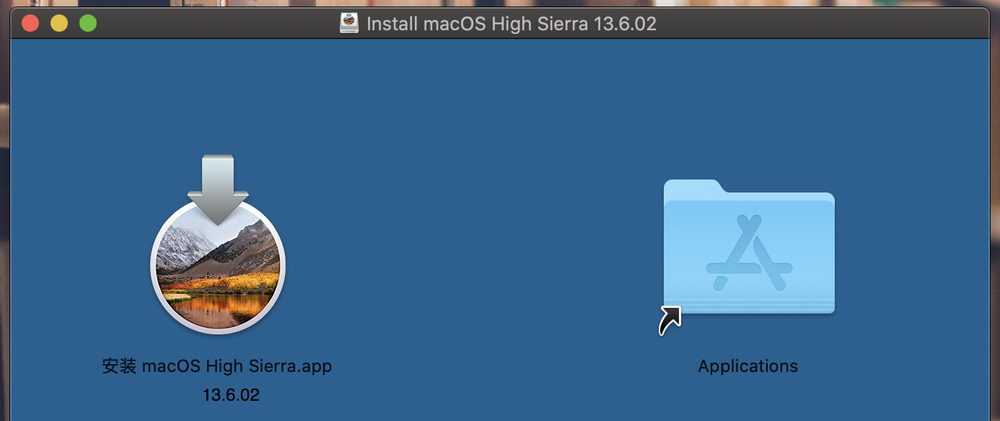
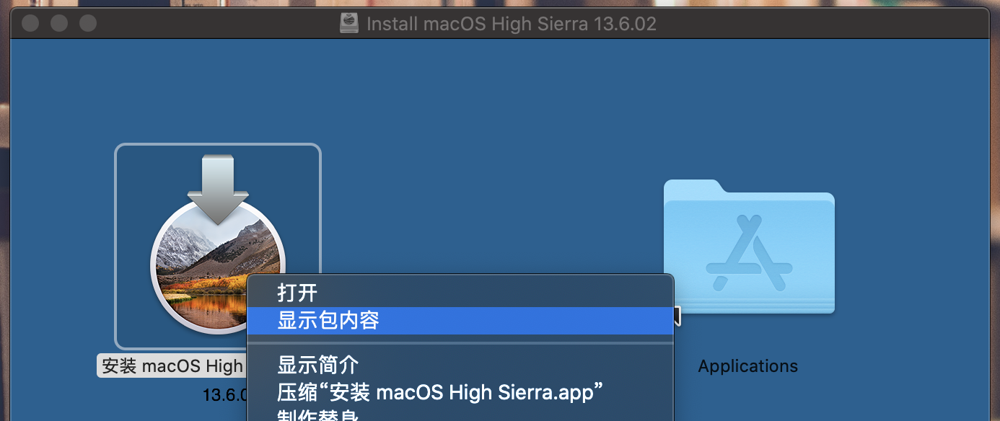
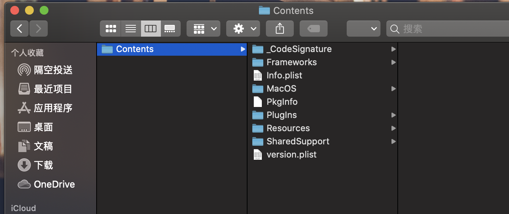
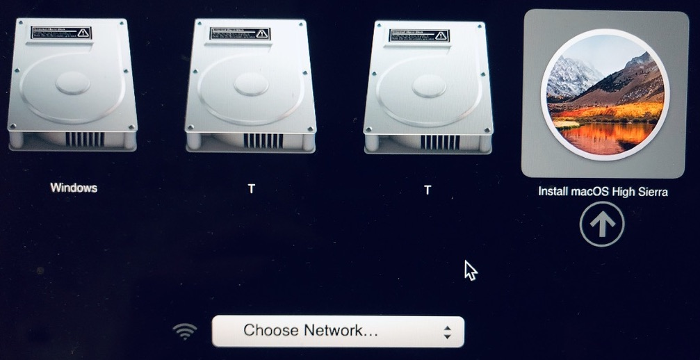
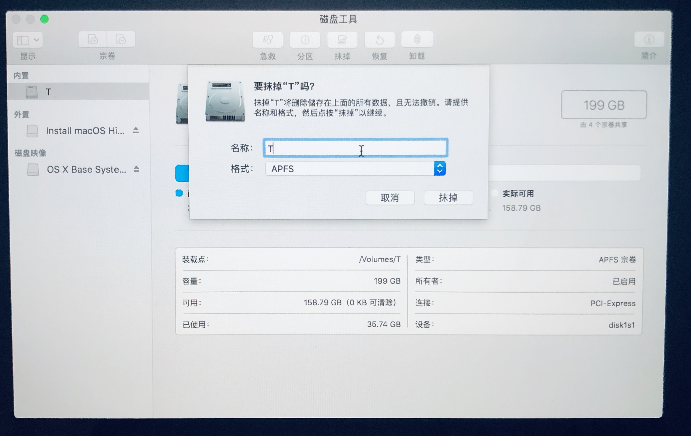
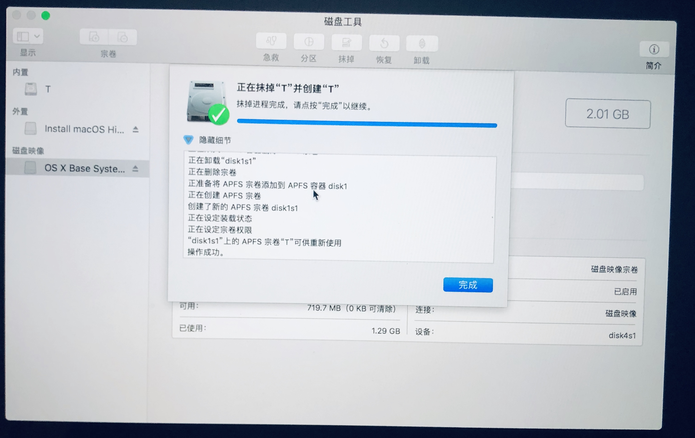
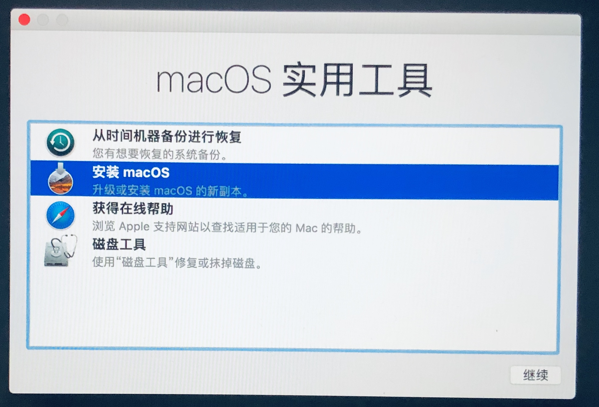
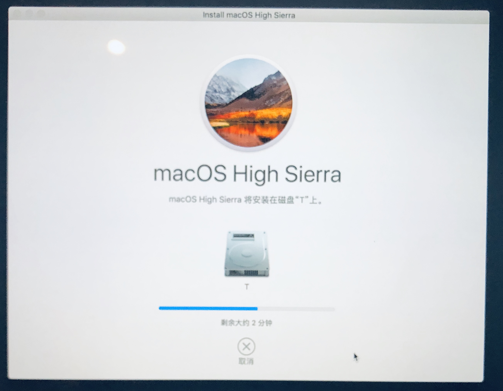

**目录**

[TOC]

操作步骤

###  一.macOS Install

#### 01.下载安装包

安装macOS 10.13.6

```
# 请使用官方链接
# wget "https://ivan-bucket-out-001.oss-cn-beijing.aliyuncs.com/out/10.13.6macOS.High.Sierra.dmg"
```

#### 02.查看安装包



右键点击安装app，显示包内容。



进入其路径。



#### 03.U盘安装命令

示例：

> sudo (把访达中的“安装 macOS High Sierra”应用中的“createinstallmedia”拖到这里) --volume (把桌面上的U盘图标拖入这里) --applicationpath (把访达中的“安装 macOS High Sierra”应用拖到这里) --nointeraction

实际操作：

```
# sudo /Volumes/Install\ macOS\ High\ Sierra\ 13.6.02/Install\ macOS\ High\ Sierra.app/Contents/Resources/createinstallmedia --volume /Volumes/MacOS --applicationpath /Volumes/Install\ macOS\ High\ Sierra\ 13.6.02/Install\ macOS\ High\ Sierra.app --nointeraction

Password:
Erasing Disk: 0%... 10%... 20%... 30%...100%...
Copying installer files to disk...
Copy complete.
Making disk bootable...
Copying boot files...
Copy complete.
Done.
```

查看结果。

```
# ls -l /Volumes/
total 0
drwxrwxr-x  14 jely  staff  544 11 16 12:45 Install macOS High Sierra
lrwxr-xr-x   1 root  wheel    1 11 16 10:47 T -> /
# ls -l /Volumes/Install\ macOS\ High\ Sierra/
total 0
drwxr-xr-x@ 3 jely  staff  102  7 13  2018 Install macOS High Sierra.app
drwxr-xr-x@ 3 jely  staff  102 11 16 12:44 Library
drwxr-xr-x@ 3 jely  staff  102 11 16 12:44 System
drwxr-xr-x@ 3 jely  staff  102 11 16 12:44 usr
```

### 二、重启安装

以下示例为覆盖安装，当然你可选择安装至磁盘分区。

#### 01.重新启动

重新启动，白苹果出现前，长按option，直接出现如下界面。

选择Install macOS High Sierra：



#### 02.磁盘清抹

稍等，进入实用工具，选择磁盘工具。


由于选择的是覆盖模式，先抹掉磁盘。





#### 02.开始安装

完成后，返回安装macOS。



如果提示安装有误，疑是版本过期。可**断网**并启用终端**修改时间**至20190101，并退出返回。

```shell
# date 月日时分年.秒

# date 010100002018.00
2018年 1月 1日 星期一 00时00分00秒 UTC
```

#### 03.开始安装

根据操作指引继续，并等待。



完成！

