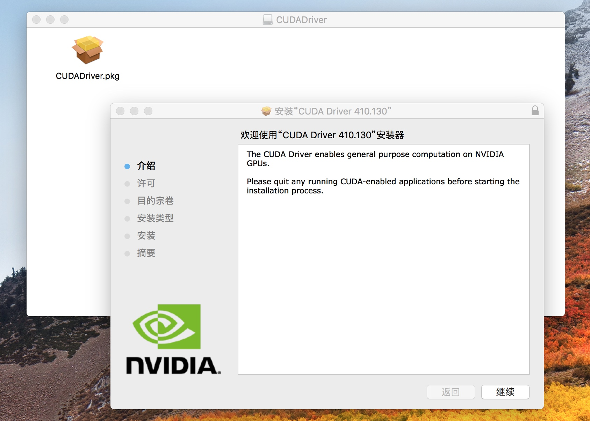
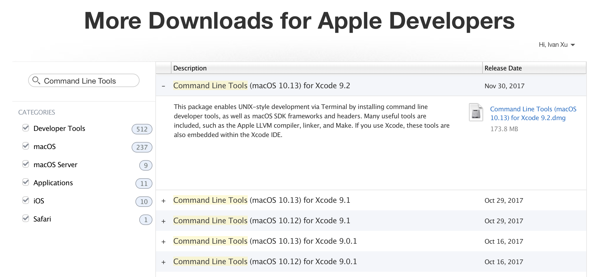

写在最前

- CPU和GPU

  


从上图可以看出：

Cache, local memory: CPU > GPU；

Threads(线程数): GPU > CPU；

Registers: GPU > CPU；

SIMD Unit: GPU > CPU；

网上有一个比喻用来比较 GPU 和 CPU ，100 个小学生(GPU)和一个大学教授(CPU)组成两队进行数学比赛，，第一回合是两队分别完成 100 道四则运算题，比赛开始，第一回合教授还在写的时候，小学生们已经完成了答题，然后进行了第二回合，第二回合是两队分别完成 1  道高等数学题目，教授已经完成了答题，100 个小学生们还在苦苦冥想。

**所以，什么类型的程序适合在GPU上运行？**

　　（1）计算密集型的程序；

　　（2）易于并行的程序；

**目录**

[TOC]


###  一、macOS Install

#### 01.下载安装包

安装macOS 10.13.6

```
# 请使用官方链接
# wget "https://ivan-bucket-out-001.oss-cn-beijing.aliyuncs.com/out/10.13.6macOS.High.Sierra.dmg"
```

#### 02.查看安装包


右键点击安装app，显示包内容。


进入其路径。


#### 03.U盘安装命令

示例：

> sudo (把访达中的“安装 macOS High Sierra”应用中的“createinstallmedia”拖到这里) --volume (把桌面上的U盘图标拖入这里) --applicationpath (把访达中的“安装 macOS High Sierra”应用拖到这里) --nointeraction

实际操作：

```
# sudo /Volumes/Install\ macOS\ High\ Sierra\ 13.6.02/Install\ macOS\ High\ Sierra.app/Contents/Resources/createinstallmedia --volume /Volumes/MacOS --applicationpath /Volumes/Install\ macOS\ High\ Sierra\ 13.6.02/Install\ macOS\ High\ Sierra.app --nointeraction

Password:
Erasing Disk: 0%... 10%... 20%... 30%...100%...
Copying installer files to disk...
Copy complete.
Making disk bootable...
Copying boot files...
Copy complete.
Done.
```

查看结果。

```
# ls -l /Volumes/
total 0
drwxrwxr-x  14 jely  staff  544 11 16 12:45 Install macOS High Sierra
lrwxr-xr-x   1 root  wheel    1 11 16 10:47 T -> /
# ls -l /Volumes/Install\ macOS\ High\ Sierra/
total 0
drwxr-xr-x@ 3 jely  staff  102  7 13  2018 Install macOS High Sierra.app
drwxr-xr-x@ 3 jely  staff  102 11 16 12:44 Library
drwxr-xr-x@ 3 jely  staff  102 11 16 12:44 System
drwxr-xr-x@ 3 jely  staff  102 11 16 12:44 usr
```

### 二、重启安装

以下示例为覆盖安装，当然你可选择安装至磁盘分区。

#### 01.重新启动

重新启动，白苹果出现前，长按option，直接出现如下界面。

选择Install macOS High Sierra：


#### 02.磁盘清抹

稍等，进入实用工具，选择磁盘工具。


由于选择的是覆盖模式，先抹掉磁盘。


#### 03.开始安装

完成后，返回安装macOS。


如果提示安装有误，疑是版本过期。可**断网**并启用终端**修改时间**至20190101，并退出返回。

```shell
# date 月日时分年.秒

# date 010100002018.00
2018年 1月 1日 星期一 00时00分00秒 UTC
```

根据操作指引继续，并等待。


完成！可得


### 三、N卡驱动

#### 01.eGPU设备

在此选用雷蛇CoreX，效果图如下：


#### 02.CoreX介绍

以下介绍来自官网，[CoreX](http://cn.razerzone.com/razer-core-x)

> 将雷蛇战核X和雷蛇灵刃13潜行版连接到一起，即可享受台式机级别的澎湃图形性能和创意生产力。
>
> ——[雷蛇官网](www.razerzone.com)


> •大幅提升各种 Thunderbolt™ 3 笔记本电脑的性能
> •支持 Windows 10 和 macOS
> •兼容 PCI-Express 显卡
> •最大 700W 电源
> •全铝制外壳

```
# macOS兼容的显卡
AMD Radeon RX 580
AMD Radeon RX 570
AMD Radeon Pro WX 7100
AMD Radeon RX Vega 56
AMD Radeon RX Vega 64
AMD Vega Frontier Edition Air
AMD Radeon Pro WX 9100
AMD Radeon RX 470
AMD Radeon RX 480
```

```
# Windows 10兼容的显卡
符合要求的 NVIDIA® GeForce® 显卡芯片组
NVIDIA® GeForce® RTX 2080 Ti
NVIDIA® GeForce® RTX 2080
NVIDIA® GeForce® RTX 2070
NVIDIA® GeForce® RTX 2060
NVIDIA® GeForce® GTX Titan X
NVIDIA® GeForce® GTX Titan V
NVIDIA® GeForce® GTX Titan Xp
NVIDIA® GeForce® GTX 1080 Ti
NVIDIA® GeForce® GTX 1080
NVIDIA® GeForce® GTX 1070 Ti
NVIDIA® GeForce® GTX 1070
NVIDIA® GeForce® GTX 1060
NVIDIA® GeForce® GTX 1050 Ti
NVIDIA® GeForce® GTX 1050
NVIDIA® GeForce® GTX 980 Ti
NVIDIA® GeForce® GTX 980
NVIDIA® GeForce® GTX 970
NVIDIA® GeForce® GTX 960
NVIDIA® GeForce® GTX 950
NVIDIA® GeForce® GTX 750 Ti
NVIDIA® GeForce® GTX 750

符合要求的 NVIDIA® Quadro® 显卡芯片组
NVIDIA® Quadro® P4000
NVIDIA® Quadro® P5000
NVIDIA® Quadro® P6000
NVIDIA® Quadro® GP100

符合要求的 AMD Radeon™ 显卡芯片组
AMD Radeon™ VII
AMD Radeon™ VEGA RX 64
AMD Radeon™ VEGA RX 56
AMD Radeon™ RX 500 系列
AMD Radeon™ RX 400 系列
AMD Radeon™ R9 Fury
AMD Radeon™ R9 Nano
AMD Radeon™ R9 300 系列
AMD Radeon™ R9 290X
AMD Radeon™ R9 290
AMD Radeon™ R9 285

显卡输出
取决于所安装之显卡的功能
```

#### 03.GPU准备

选用[Nvidia](https://www.nvidia.cn)即英伟达N卡，通过各网商渠道均可购得。

最后考虑性价比选定NVIDIA TITAN Xp


> .TITAN Xp 由 3840 个 NVIDIA® CUDA® 核心驱动，运行频率达到 1.6 GHz，它采用 Brute Force 算法，运算效能可达 12 万亿次浮点运算。此外，它搭载 12 GB 的 GDDR5X 显存，运行速度超过 11 Gbps。 

#### 04.设备安装

根据线路设置安装，效果图：


随即通过连接进行设备检测。

```shell
## Linux
# 设备检测
lspci
# 安装thunderbolt，类似乌班图一般自带
yum install bolt
# boltctl命令
boltctl status
boltctl list
boltctl info cb010000-0000-7508-23e0-7d0b04805120
boltctl authorize cb010000-0000-7508-23e0-7d0b04805120
```

若是macOS，直接连接并通过**系统信息**可查看。


已完成设备连接。

#### 05.驱动安装

> 根据https://gfe.nvidia.com/mac-update，选择对应系统版本。
>
> 并通过https://github.com/mayankk2308/purge-wrangler安装purge-wrangler。

```shell
$ curl -qLs $(curl -qLs https://bit.ly/2WtIESm | grep '"browser_download_url":' | cut -d'"' -f4) > purge-wrangler.sh; bash purge-wrangler.sh; rm purge-wrangler.sh
Password:
>> PurgeWrangler (6.2.0)

 1. Setup eGPU
 2. System Status
 3. Uninstall

 4. More Options
 5. Donate
 6. Quit

>> Setup eGPU

Plug-in eGPU. Press ESC if you are not plugging in eGPU.

External GPU	TITAN Xp
GPU Arch	GP102 
Thunderbolt	3

Backing up...
Backup complete.

Fetching driver information...
Information fetched.
Downloading drivers (387.10.10.10.40.105)...
######################################################################## 100.0%
Download complete.
Sanitizing package...
Package sanitized.
Installing...
Installation complete.

Patching for NVIDIA eGPUs...
Patches applied.

Analyzing system...
No anomalies expected.

Sanitizing system...
System sanitized.
Modifications complete.

Reboot to apply changes.

Reboot Now? [Y/N]: Y

```

重启后完成。并可通过CoreX接外置屏幕，实现上述效果图。


### 四、辅助安装-CUDA

#### 01.CUDA Driver

> https://www.nvidia.com/en-us/drivers/cuda/mac-driver-archive/

注意系统版本和CUDA Toolkit版本，选用以下版本：

```
# RELEASE HIGHLIGHTS
New Release 410.130 
	CUDA driver update to support CUDA Toolkit 10.0 and macOS 10.13.6
Recommended CUDA version(s): 
	CUDA 10.0
Supported macOS 
	10.13
```

开始安装



按照指引完成。

#### 02.CUDA Toolkit

根据版本，选用CUDA Toolkit 10.0


开始安装


继续，可见需安装CUDA Driver、CUDA Toolkit、CUDA Samples，等待


#### 03.CUDA 环境配置

编辑~/.bash_profile 文件

```
# open -e ~/.bash_profile
```

在文件末尾加入

```shell
export CUDA_HOME=/usr/local/cuda
export DYLD_LIBRARY_PATH="$CUDA_HOME/lib:$CUDA_HOME/extras/CUPTI/lib"
export LD_LIBRARY_PATH=$DYLD_LIBRARY_PATH
export PATH=$DYLD_LIBRARY_PATH:$PATH
export flags="--config=cuda --config=opt"
 
export PATH="/Developer/NVIDIA/CUDA-10.0/bin:$PATH"
```

执行：

```
# . ~/.bash_profile
```

#### 04.CUDA 测试

首先需可执行make，在macOS中通过Command Line Tools安装。

终端输入：

```shell
make
```

根据跳出页面安装之。


完成后如下：

```
# make
xcode-select: note: no developer tools were found at '/Applications/Xcode.app', requesting install. Choose an option in the dialog to download the command line developer tools.

# make
make: *** No targets specified and no makefile found.  Stop.
```

试运行以下命令。

```shell
# 测试脚本1
cd /usr/local/cuda/samples
sudo make -C 1_Utilities/deviceQuery
./bin/x86_64/darwin/release/deviceQuery
```

若出现**ERROR：nvcc fatal  : The version ('10.0') of the host compiler ('Apple clang') is not supported**，尝试修复之。

（1）通过[官网]( https://developer.apple.com/downloads/ )，搜索Command Line Tools，对应系统版本，重新下载；

在此选择Command_Line_Tools(macOS_10.13)for_Xcode_9.2，



（2）安装Command Line Tools；


（3）执行命令

```shell
sudo xcode-select --switch /Library/Developer/CommandLineTools
```

修复后，重新运行测试脚本1。

```
## 测试脚本1
# cd /usr/local/cuda/samples

# sudo make -C 1_Utilities/deviceQuery
xcode-select: error: tool 'xcodebuild' requires Xcode, but active developer directory '/Library/Developer/CommandLineTools' is a command line tools instance
expr: syntax error
/Developer/NVIDIA/CUDA-10.0/bin/nvcc -ccbin g++ -I../../common/inc  -m64  -Xcompiler -arch -Xcompiler x86_64  -gencode arch=compute_30,code=sm_30 -gencode arch=compute_35,code=sm_35 -gencode arch=compute_37,code=sm_37 -gencode arch=compute_50,code=sm_50 -gencode arch=compute_52,code=sm_52 -gencode arch=compute_60,code=sm_60 -gencode arch=compute_61,code=sm_61 -gencode arch=compute_70,code=sm_70 -gencode arch=compute_70,code=compute_70 -o deviceQuery.o -c deviceQuery.cpp
/Developer/NVIDIA/CUDA-10.0/bin/nvcc -ccbin g++   -m64  -Xcompiler -arch -Xcompiler x86_64  -Xlinker -rpath -Xlinker /Developer/NVIDIA/CUDA-10.0/lib  -gencode arch=compute_30,code=sm_30 -gencode arch=compute_35,code=sm_35 -gencode arch=compute_37,code=sm_37 -gencode arch=compute_50,code=sm_50 -gencode arch=compute_52,code=sm_52 -gencode arch=compute_60,code=sm_60 -gencode arch=compute_61,code=sm_61 -gencode arch=compute_70,code=sm_70 -gencode arch=compute_70,code=compute_70 -o deviceQuery deviceQuery.o 
mkdir -p ../../bin/x86_64/darwin/release
cp deviceQuery ../../bin/x86_64/darwin/release

# ./bin/x86_64/darwin/release/deviceQuery
./bin/x86_64/darwin/release/deviceQuery Starting...

 CUDA Device Query (Runtime API) version (CUDART static linking)

Detected 1 CUDA Capable device(s)

Device 0: "TITAN Xp"
  CUDA Driver Version / Runtime Version          10.0 / 10.0
  CUDA Capability Major/Minor version number:    6.1
  Total amount of global memory:                 12288 MBytes (12884705280 bytes)
  (30) Multiprocessors, (128) CUDA Cores/MP:     3840 CUDA Cores
  GPU Max Clock rate:                            1582 MHz (1.58 GHz)
  Memory Clock rate:                             5705 Mhz
  Memory Bus Width:                              384-bit
  L2 Cache Size:                                 3145728 bytes
  Maximum Texture Dimension Size (x,y,z)         1D=(131072), 2D=(131072, 65536), 3D=(16384, 16384, 16384)
  Maximum Layered 1D Texture Size, (num) layers  1D=(32768), 2048 layers
  Maximum Layered 2D Texture Size, (num) layers  2D=(32768, 32768), 2048 layers
  Total amount of constant memory:               65536 bytes
  Total amount of shared memory per block:       49152 bytes
  Total number of registers available per block: 65536
  Warp size:                                     32
  Maximum number of threads per multiprocessor:  2048
  Maximum number of threads per block:           1024
  Max dimension size of a thread block (x,y,z): (1024, 1024, 64)
  Max dimension size of a grid size    (x,y,z): (2147483647, 65535, 65535)
  Maximum memory pitch:                          2147483647 bytes
  Texture alignment:                             512 bytes
  Concurrent copy and kernel execution:          Yes with 2 copy engine(s)
  Run time limit on kernels:                     Yes
  Integrated GPU sharing Host Memory:            No
  Support host page-locked memory mapping:       Yes
  Alignment requirement for Surfaces:            Yes
  Device has ECC support:                        Disabled
  Device supports Unified Addressing (UVA):      Yes
  Device supports Compute Preemption:            Yes
  Supports Cooperative Kernel Launch:            Yes
  Supports MultiDevice Co-op Kernel Launch:      Yes
  Device PCI Domain ID / Bus ID / location ID:   0 / 196 / 0
  Compute Mode:
     < Default (multiple host threads can use ::cudaSetDevice() with device simultaneously) >

deviceQuery, CUDA Driver = CUDART, CUDA Driver Version = 10.0, CUDA Runtime Version = 10.0, NumDevs = 1
Result = PASS

```

Result=PASS，即CUDA已正常运行。

#### 05.CUDA GPU压测

结合CUDA，并系统自带的活动监视器-GPU历史记录，对GPU进行简单压测。

```
## 测试脚本2
# cd /usr/local/cuda/samples

# sudo make -C 1_Utilities/UnifiedMemoryPerf/
xcode-select: error: tool 'xcodebuild' requires Xcode, but active developer directory '/Library/Developer/CommandLineTools' is a command line tools instance
expr: syntax error
/Developer/NVIDIA/CUDA-10.0/bin/nvcc -ccbin g++ -I../../common/inc  -m64  -Xcompiler -arch -Xcompiler x86_64  -gencode arch=compute_30,code=sm_30 -gencode arch=compute_35,code=sm_35 -gencode arch=compute_37,code=sm_37 -gencode arch=compute_50,code=sm_50 -gencode arch=compute_52,code=sm_52 -gencode arch=compute_60,code=sm_60 -gencode arch=compute_61,code=sm_61 -gencode arch=compute_70,code=sm_70 -gencode arch=compute_70,code=compute_70 -o commonKernels.o -c commonKernels.cu
/Developer/NVIDIA/CUDA-10.0/bin/nvcc -ccbin g++ -I../../common/inc  -m64  -Xcompiler -arch -Xcompiler x86_64  -gencode arch=compute_30,code=sm_30 -gencode arch=compute_35,code=sm_35 -gencode arch=compute_37,code=sm_37 -gencode arch=compute_50,code=sm_50 -gencode arch=compute_52,code=sm_52 -gencode arch=compute_60,code=sm_60 -gencode arch=compute_61,code=sm_61 -gencode arch=compute_70,code=sm_70 -gencode arch=compute_70,code=compute_70 -o helperFunctions.o -c helperFunctions.cpp
/Developer/NVIDIA/CUDA-10.0/bin/nvcc -ccbin g++ -I../../common/inc  -m64  -Xcompiler -arch -Xcompiler x86_64  -gencode arch=compute_30,code=sm_30 -gencode arch=compute_35,code=sm_35 -gencode arch=compute_37,code=sm_37 -gencode arch=compute_50,code=sm_50 -gencode arch=compute_52,code=sm_52 -gencode arch=compute_60,code=sm_60 -gencode arch=compute_61,code=sm_61 -gencode arch=compute_70,code=sm_70 -gencode arch=compute_70,code=compute_70 -o matrixMultiplyPerf.o -c matrixMultiplyPerf.cu
/Developer/NVIDIA/CUDA-10.0/bin/nvcc -ccbin g++   -m64  -Xcompiler -arch -Xcompiler x86_64  -Xlinker -rpath -Xlinker /Developer/NVIDIA/CUDA-10.0/lib  -gencode arch=compute_30,code=sm_30 -gencode arch=compute_35,code=sm_35 -gencode arch=compute_37,code=sm_37 -gencode arch=compute_50,code=sm_50 -gencode arch=compute_52,code=sm_52 -gencode arch=compute_60,code=sm_60 -gencode arch=compute_61,code=sm_61 -gencode arch=compute_70,code=sm_70 -gencode arch=compute_70,code=compute_70 -o UnifiedMemoryPerf commonKernels.o helperFunctions.o matrixMultiplyPerf.o 
mkdir -p ../../bin/x86_64/darwin/release
cp UnifiedMemoryPerf ../../bin/x86_64/darwin/release

# ./bin/x86_64/darwin/release/UnifiedMemoryPerf 
GPU Device 0: "TITAN Xp" with compute capability 6.1

Running ........................................................

Overall Time For matrixMultiplyPerf 

Printing Average of 20 measurements in (ms)
Size_KB	 UMhint	UMhntAs	 UMeasy	  0Copy	MemCopy	CpAsync	CpHpglk	CpPglAs
4	  0.475	  4.948	  0.342	  0.101	  0.133	  0.113	  0.160	  0.108
16	  0.492	  5.023	  0.392	  0.145	  0.168	  0.137	  0.193	  0.201
64	  0.735	  5.244	  0.611	  0.451	  0.286	  0.324	  0.291	  0.237
256	  2.015	  6.532	  1.902	  2.741	  0.759	  0.731	  0.804	  0.750
1024	  7.242	 11.865	  7.103	 19.801	  2.880	  2.866	  2.748	  2.701
4096	 36.291	 40.805	 37.507	159.053	 11.221	 11.063	 12.452	 14.087
16384	121.645	145.522	123.710	1238.812	 48.859	 49.248	 52.273	 52.816

NOTE: The CUDA Samples are not meant for performance measurements. Results may vary when GPU Boost is enabled.
```

GPU记录如下：


*注：Intel Iris Graphics 550为系统自带。*

### 五、辅助安装-cuDNN

#### 01.cuDNN 安装

选用对应版本，需CUDA 10.0，在此试选cuDNN v7.6.4 for OSX，版本较新。


#### 02.解压安装包

```
# cd /Users/jely/Downloads

# sudo tar xvf cudnn-10.0-osx-x64-v7.6.4.38.tar
Password:
x cuda/include/cudnn.h
x cuda/NVIDIA_SLA_cuDNN_Support.txt
x cuda/lib/libcudnn.7.dylib
x cuda/lib/libcudnn.dylib
x cuda/lib/libcudnn_static.a
```

#### 03.文件复制

在文件复制前，注意到不同安装教程有不同命令，主要区别在拷贝至/usr/local/cuda或/Developer/NVIDIA/CUDA-，在此先查看上述路径是否一致。

```
# ls -l /usr/local/cuda/
total 0
lrwxr-xr-x@  1 root  wheel    58  9 13  2018 CUDA_Toolkit_Release_Notes.txt -> /Developer/NVIDIA/CUDA-10.0/CUDA_Toolkit_Release_Notes.txt
lrwxr-xr-x@  1 root  wheel    36  9 13  2018 EULA.txt -> /Developer/NVIDIA/CUDA-10.0/EULA.txt
lrwxr-xr-x@  1 root  wheel    45  9 13  2018 NsightCompute-1.0 -> /Developer/NVIDIA/CUDA-10.0/NsightCompute-1.0
lrwxr-xr-x@  1 root  wheel    31  9 13  2018 bin -> /Developer/NVIDIA/CUDA-10.0/bin
lrwxr-xr-x@  1 root  wheel    31  9 13  2018 doc -> /Developer/NVIDIA/CUDA-10.0/doc
lrwxr-xr-x@  1 root  wheel    34  9 13  2018 extras -> /Developer/NVIDIA/CUDA-10.0/extras
lrwxr-xr-x@  1 root  wheel    35  9 13  2018 include -> /Developer/NVIDIA/CUDA-10.0/include
lrwxr-xr-x@  1 root  wheel    31  9 13  2018 jre -> /Developer/NVIDIA/CUDA-10.0/jre
drwxr-xr-x  79 root  wheel  2528 11 19 02:12 lib
lrwxr-xr-x@  1 root  wheel    37  9 13  2018 libnsight -> /Developer/NVIDIA/CUDA-10.0/libnsight
lrwxr-xr-x@  1 root  wheel    35  9 13  2018 libnvvp -> /Developer/NVIDIA/CUDA-10.0/libnvvp
lrwxr-xr-x@  1 root  wheel    44  9 13  2018 nsightee_plugins -> /Developer/NVIDIA/CUDA-10.0/nsightee_plugins
lrwxr-xr-x@  1 root  wheel    32  9 13  2018 nvvm -> /Developer/NVIDIA/CUDA-10.0/nvvm
lrwxr-xr-x@  1 root  wheel    35  9 13  2018 samples -> /Developer/NVIDIA/CUDA-10.0/samples
lrwxr-xr-x@  1 root  wheel    31  9 13  2018 src -> /Developer/NVIDIA/CUDA-10.0/src
lrwxr-xr-x@  1 root  wheel    33  9 13  2018 tools -> /Developer/NVIDIA/CUDA-10.0/tools
lrwxr-xr-x@  1 root  wheel    39  9 13  2018 version.txt -> /Developer/NVIDIA/CUDA-10.0/version.txt
```

可知，/usr/local/cuda/即/Developer/NVIDIA/CUDA的软链接，故而命令一致。

开始拷贝：

```
# cd /Users/jely/Downloads

# ls -l cuda
total 80
-r--r--r--@ 1 jely  staff  38963  2 22  2019 NVIDIA_SLA_cuDNN_Support.txt
drwxr-xr-x  3 root  staff     96 11 19 03:18 include
drwxr-xr-x  5 root  staff    160 11 19 03:19 lib
```

```shell
sudo cp cuda/include/cudnn.h /usr/local/cuda/include
sudo cp cuda/lib/libcudnn* /usr/local/cuda/lib
sudo chmod a+r /usr/local/cuda/include/cudnn.h /usr/local/cuda/lib/libcudnn*
```

修改~/.bash_profile，并执行。

```
# open -e ~/.bash_profile

# . ~/.bash_profile
```

添加：

```shell
export  DYLD_LIBRARY_PATH=/usr/local/cuda/lib:$DYLD_LIBRARY_PATH
```

#### 04.安装验证

```
# echo -e '#include"cudnn.h"\n void main(){}' | nvcc -x c - -o /dev/null -I/usr/local/cuda/include -L/usr/local/cuda/lib -lcudnn
/var/folders/0g/gzptltgj5zd9ftt6fkq59ylm0000gn/T//tmpxft_00000869_00000000-0_stdin:2:2: warning: return type of 'main'
      is not 'int' [-Wmain-return-type]
 void main(){}
 ^
/var/folders/0g/gzptltgj5zd9ftt6fkq59ylm0000gn/T//tmpxft_00000869_00000000-0_stdin:2:2: note: change return type to
      'int'
 void main(){}
 ^~~~
 int
1 warning generated.
```

仅warning，貌似没有问题。TODO：通过[官网案例](https://docs.nvidia.com/deeplearning/sdk/cudnn-install/index.html#install-mac)验证cuDNN。

### 六、辅助安装-结果查看

#### 01.配置查看

macOS通过系统偏好设置-CUDA Preferences查看。


#### 02.命令查看

```
# nvcc -V
nvcc: NVIDIA (R) Cuda compiler driver
Copyright (c) 2005-2018 NVIDIA Corporation
Built on Sat_Aug_25_21:08:56_CDT_2018
Cuda compilation tools, release 10.0, V10.0.130

# cat /usr/local/cuda/version.txt
CUDA Version 10.0.130

# cat /usr/local/cuda/include/cudnn.h | grep CUDNN_MAJOR -A 2
#define CUDNN_MAJOR 7
#define CUDNN_MINOR 6
#define CUDNN_PATCHLEVEL 4
--
#define CUDNN_VERSION (CUDNN_MAJOR * 1000 + CUDNN_MINOR * 100 + CUDNN_PATCHLEVEL)

#include "driver_types.h"
```

无误。


