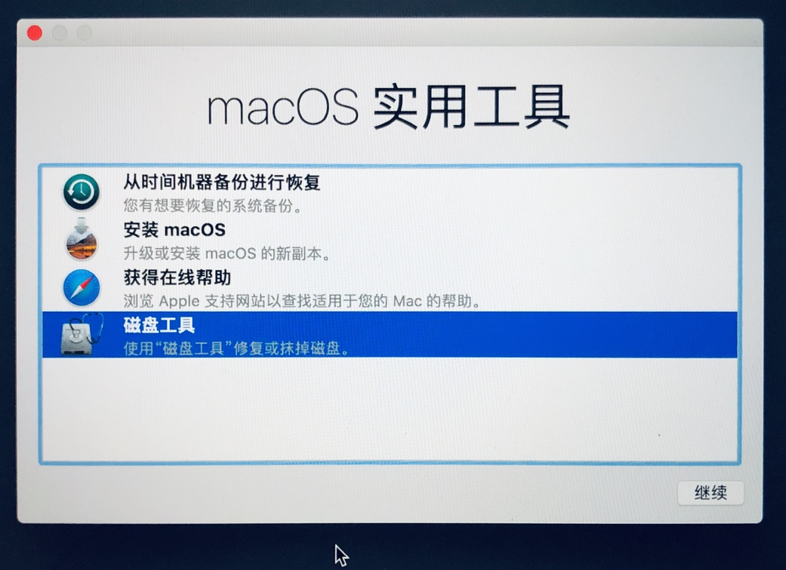

**目录**

[TOC]

操作步骤

###  一、macOS Install

#### 01.下载安装包

安装macOS 10.13.6

```
# 请使用官方链接
# wget "https://ivan-bucket-out-001.oss-cn-beijing.aliyuncs.com/out/10.13.6macOS.High.Sierra.dmg"
```

#### 02.查看安装包


右键点击安装app，显示包内容。


进入其路径。


#### 03.U盘安装命令

示例：

> sudo (把访达中的“安装 macOS High Sierra”应用中的“createinstallmedia”拖到这里) --volume (把桌面上的U盘图标拖入这里) --applicationpath (把访达中的“安装 macOS High Sierra”应用拖到这里) --nointeraction

实际操作：

```
# sudo /Volumes/Install\ macOS\ High\ Sierra\ 13.6.02/Install\ macOS\ High\ Sierra.app/Contents/Resources/createinstallmedia --volume /Volumes/MacOS --applicationpath /Volumes/Install\ macOS\ High\ Sierra\ 13.6.02/Install\ macOS\ High\ Sierra.app --nointeraction

Password:
Erasing Disk: 0%... 10%... 20%... 30%...100%...
Copying installer files to disk...
Copy complete.
Making disk bootable...
Copying boot files...
Copy complete.
Done.
```

查看结果。

```
# ls -l /Volumes/
total 0
drwxrwxr-x  14 jely  staff  544 11 16 12:45 Install macOS High Sierra
lrwxr-xr-x   1 root  wheel    1 11 16 10:47 T -> /
# ls -l /Volumes/Install\ macOS\ High\ Sierra/
total 0
drwxr-xr-x@ 3 jely  staff  102  7 13  2018 Install macOS High Sierra.app
drwxr-xr-x@ 3 jely  staff  102 11 16 12:44 Library
drwxr-xr-x@ 3 jely  staff  102 11 16 12:44 System
drwxr-xr-x@ 3 jely  staff  102 11 16 12:44 usr
```

### 二、重启安装

以下示例为覆盖安装，当然你可选择安装至磁盘分区。

#### 01.重新启动

重新启动，白苹果出现前，长按option，直接出现如下界面。

选择Install macOS High Sierra：


#### 02.磁盘清抹

稍等，进入实用工具，选择磁盘工具。



由于选择的是覆盖模式，先抹掉磁盘。


#### 03.开始安装

完成后，返回安装macOS。


如果提示安装有误，疑是版本过期。可**断网**并启用终端**修改时间**至20190101，并退出返回。

``` shell
# date 月日时分年.秒

# date 010100002018.00
2018年 1月 1日 星期一 00时00分00秒 UTC
```

根据操作指引继续，并等待。


完成！可得


### 三、N卡驱动

#### 01.eGPU设备

在此选用雷蛇CoreX，效果图如下：


#### 02.CoreX介绍

以下介绍来自官网，[CoreX](http://cn.razerzone.com/razer-core-x)

> 将雷蛇战核X和雷蛇灵刃13潜行版连接到一起，即可享受台式机级别的澎湃图形性能和创意生产力。
>
> ——[雷蛇官网](www.razerzone.com)


> •大幅提升各种 Thunderbolt™ 3 笔记本电脑的性能
> •支持 Windows 10 和 macOS
> •兼容 PCI-Express 显卡
> •最大 700W 电源
> •全铝制外壳

```
# macOS兼容的显卡
AMD Radeon RX 580
AMD Radeon RX 570
AMD Radeon Pro WX 7100
AMD Radeon RX Vega 56
AMD Radeon RX Vega 64
AMD Vega Frontier Edition Air
AMD Radeon Pro WX 9100
AMD Radeon RX 470
AMD Radeon RX 480
```

```
# Windows 10兼容的显卡
符合要求的 NVIDIA® GeForce® 显卡芯片组
NVIDIA® GeForce® RTX 2080 Ti
NVIDIA® GeForce® RTX 2080
NVIDIA® GeForce® RTX 2070
NVIDIA® GeForce® RTX 2060
NVIDIA® GeForce® GTX Titan X
NVIDIA® GeForce® GTX Titan V
NVIDIA® GeForce® GTX Titan Xp
NVIDIA® GeForce® GTX 1080 Ti
NVIDIA® GeForce® GTX 1080
NVIDIA® GeForce® GTX 1070 Ti
NVIDIA® GeForce® GTX 1070
NVIDIA® GeForce® GTX 1060
NVIDIA® GeForce® GTX 1050 Ti
NVIDIA® GeForce® GTX 1050
NVIDIA® GeForce® GTX 980 Ti
NVIDIA® GeForce® GTX 980
NVIDIA® GeForce® GTX 970
NVIDIA® GeForce® GTX 960
NVIDIA® GeForce® GTX 950
NVIDIA® GeForce® GTX 750 Ti
NVIDIA® GeForce® GTX 750

符合要求的 NVIDIA® Quadro® 显卡芯片组
NVIDIA® Quadro® P4000
NVIDIA® Quadro® P5000
NVIDIA® Quadro® P6000
NVIDIA® Quadro® GP100

符合要求的 AMD Radeon™ 显卡芯片组
AMD Radeon™ VII
AMD Radeon™ VEGA RX 64
AMD Radeon™ VEGA RX 56
AMD Radeon™ RX 500 系列
AMD Radeon™ RX 400 系列
AMD Radeon™ R9 Fury
AMD Radeon™ R9 Nano
AMD Radeon™ R9 300 系列
AMD Radeon™ R9 290X
AMD Radeon™ R9 290
AMD Radeon™ R9 285

显卡输出
取决于所安装之显卡的功能
```

#### 03.GPU准备

选用[Nvidia](https://www.nvidia.cn)即英伟达N卡，通过各网商渠道均可购得。

最后考虑性价比选定NVIDIA TITAN Xp


> .TITAN Xp 由 3840 个 NVIDIA® CUDA® 核心驱动，运行频率达到 1.6 GHz，它采用 Brute Force 算法，运算效能可达 12 万亿次浮点运算。此外，它搭载 12 GB 的 GDDR5X 显存，运行速度超过 11 Gbps。 

#### 04.设备安装

根据线路设置安装，效果图：


随即通过连接进行设备检测。

```
## Linux
# 设备检测
lspci
# 安装thunderbolt，类似乌班图一般自带
yum install bolt
# boltctl命令
boltctl status
boltctl list
boltctl info cb010000-0000-7508-23e0-7d0b04805120
boltctl authorize cb010000-0000-7508-23e0-7d0b04805120
```

若是macOS，直接连接并通过**系统信息**可查看。


已完成设备连接。

#### 05.驱动安装

> 根据[显卡驱动](https://gfe.nvidia.com/mac-update)，选择对应系统版本，并安装[purge-wrangler](https://github.com/mayankk2308/purge-wrangler)。

```
$ curl -qLs $(curl -qLs https://bit.ly/2WtIESm | grep '"browser_download_url":' | cut -d'"' -f4) > purge-wrangler.sh; bash purge-wrangler.sh; rm purge-wrangler.sh
Password:
>> PurgeWrangler (6.2.0)

 1. Setup eGPU
 2. System Status
 3. Uninstall

 4. More Options
 5. Donate
 6. Quit

>> Setup eGPU

Plug-in eGPU. Press ESC if you are not plugging in eGPU.

External GPU	TITAN Xp
GPU Arch	GP102 
Thunderbolt	3

Backing up...
Backup complete.

Fetching driver information...
Information fetched.
Downloading drivers (387.10.10.10.40.105)...
######################################################################## 100.0%
Download complete.
Sanitizing package...
Package sanitized.
Installing...
Installation complete.

Patching for NVIDIA eGPUs...
Patches applied.

Analyzing system...
No anomalies expected.

Sanitizing system...
System sanitized.
Modifications complete.

Reboot to apply changes.

Reboot Now? [Y/N]: Y

```

重启后完成。并可通过CoreX接外置屏幕，实现上述效果图。


