# SNA网络切割
------
#### 一、维护指引

手动执行以下步骤，维护nodes_del数据集，请勿加入跑批代码，建议nodes_del数据集更新频率为**一个月**。

一共分5步：

1. 声明切割网络编号

   ```SAS
   %LET CLUS = 10001;
   ```

2. 获取链接信息

   ```SAS
   DATA LINKS;
   SET &ODS..LINKS2;
   WHERE CLUSTER_ID = "&CLUS.";
   RUN;
   ```

3. 执行optgraph

   ```SAS
   PROC OPTGRAPH 
   LINKS = LINKS OUT_NODES = NODES_OUT;
   LINKS_VAR FROM = FROM_NODE_ID TO = TO_NODE_ID;
   BICONCOMP;
   QUIT;
   ```

4. 选择切割实体

   ```sas
   DATA NODES_DEL;
   SET NODES_OUT;
   WHERE ARTPOINT = 1;
   RUN;
   
   PROC SQL;
   CREATE TABLE NODES_D AS 
   SELECT A.*
   FROM &ODS..NODES2 A
   INNER JOIN NODES_DEL B
   ON A.UID = B.NODE;
   QUIT;
   ```

5. 存储切割实体数据集

   ```SAS
   DATA &ODS..NODES_DEL;
   SET NODES_D;
   WHERE NODE_TYPE ^= "APPNO";
   RUN;
   ```

#### 二、优化网络质量

1. 丰富网络评价变量

   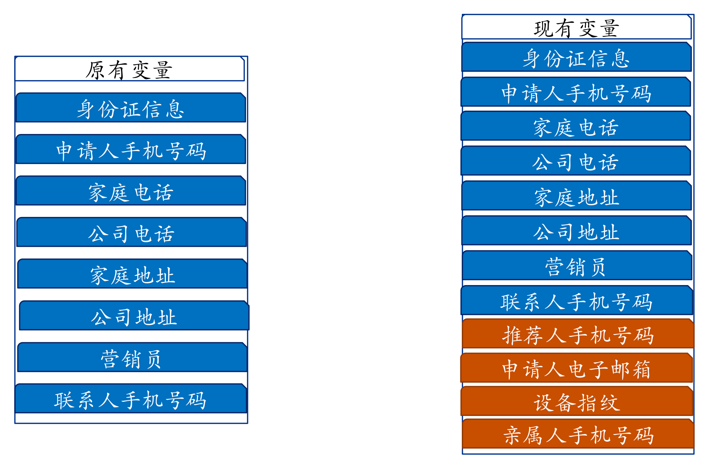

2. 网络规模庞大原因

   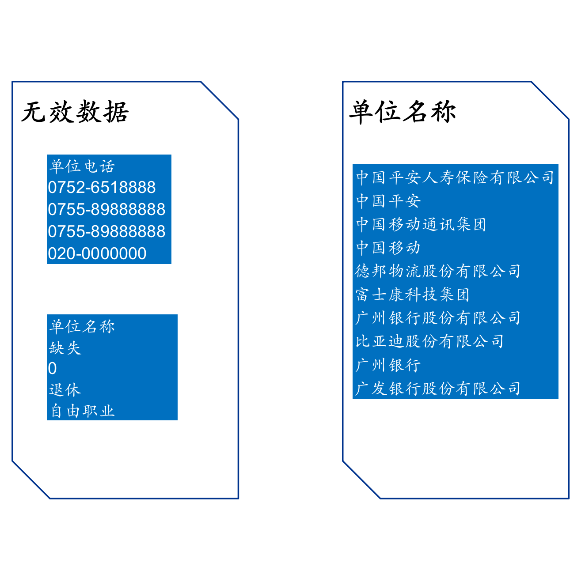

3. 提升数据质量

   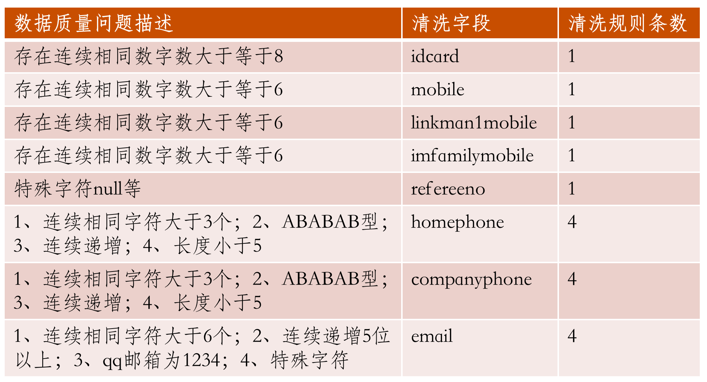

4. 网络切割-算法切割

   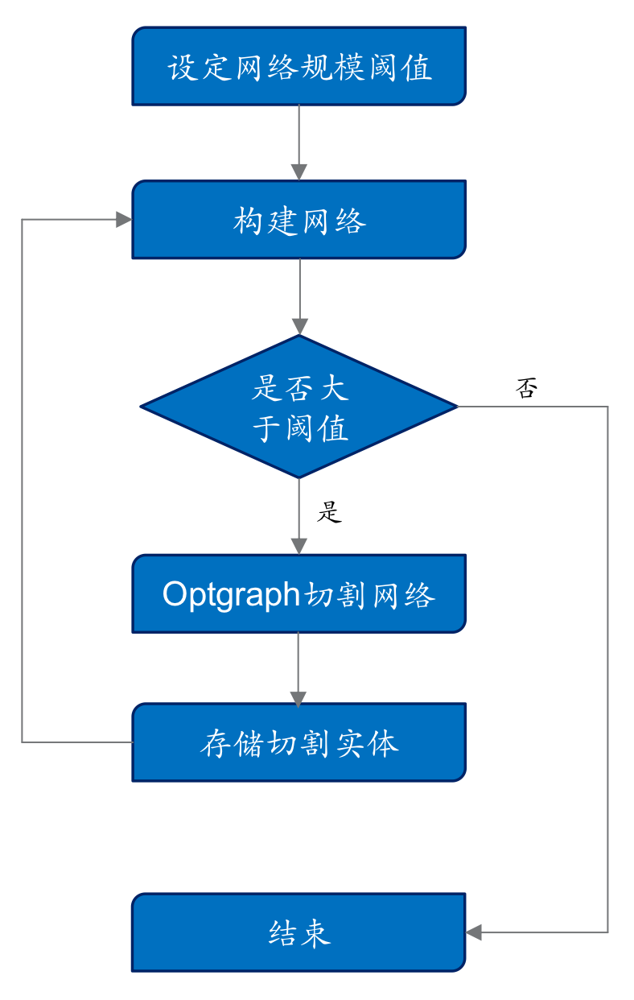

5. 网络切割-OPTGRAPH

   ​	删除团C，详见OPTGRAPH算法。

   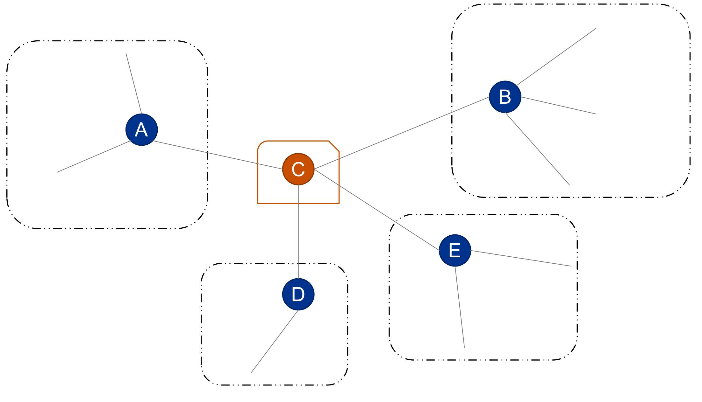

6. 网络规模分布

   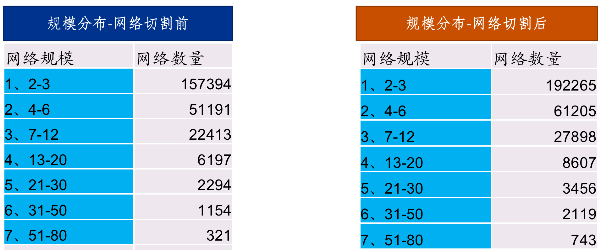

#### 三、OPTGRAPH算法

1. PROC OPTGRAPH简介

   ​	PROC OPTGRAPH过程步，包括许多图形理论、组合优化和网络分析算法。

   ​	参考[SAS Help](http://documentation.sas.com/?docsetId=procgralg&docsetTarget=procgralg_optgraph_details15.htm&docsetVersion=15.1&locale=zh-CN)，算法种类见下表：

   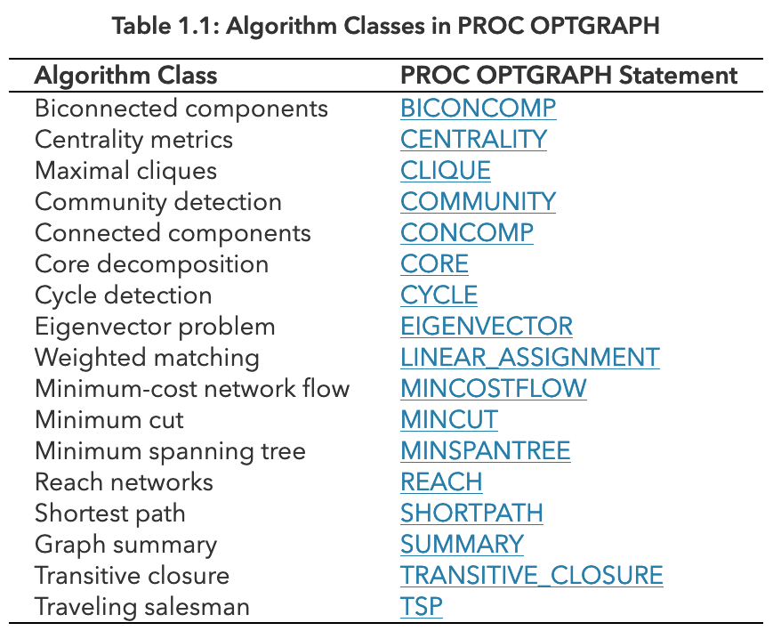

   ​	如上`代码3`，网络切割的核心用到了BICONCOMP，即**Biconnected Component**（**重连通分量**）。

2. 图论基础

   ​	无向图，边没有方向的图称为**无向图**。

   ​	如果图中任意两点都是连通的，那么图被称作**连通图**。

   ​	在一个无向图中，如果删除某个顶点及其相关联的边后，原来的图被分割为两个及以上的连通分量，则称该顶点为无向图中的一个**关节点**。	

   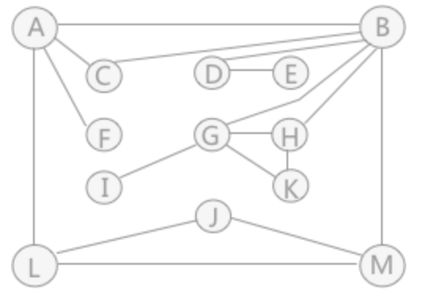

   ​	如图，是连通图但不是重连通图，图中有4个关节点，分别是：A、B、D 和 G。

   ​	比如删除顶点 B 及相关联的边后，原图就变为：

   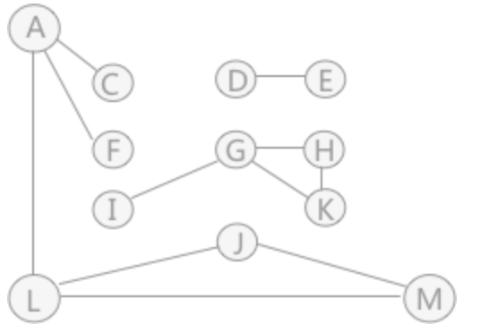

    可以看到，图被分割为各自独立的 3 部分，顶点集合分别为：{A、C、F、L、M、J}、{G、H、I、K} 和 {D、E}。

    了解什么是关节点后，**重连通图**其实就是没有关节点的连通图。

    即在删除某个顶点及该顶点相关的边后，图中各顶点之间的连通性也不会被破坏。
   
    重连通分量，一个连通图如果不是重连通图，那么它可以包括几个**重连通分量**。	
   
3. 重连通图的实际应用

    在重连通图中，只删除一个顶点及其相关联的边，肯定不会破坏其连通性。如果一味地做删除顶点的操作，直到删除 K 个顶点及其关联的边后，图的连通性才遭到破坏，则称此重连通图的**连通度**为 K。
    
    同样，小到城市之间，大到国家之间的航空网也可以看作是一个连通图，但如果此图建设成为重连通图，当某条航线因为天气等因素关闭时，飞机仍可以从别的航线到达目的地。在战争中，有“兵马未动，粮草先行”的说法，可见后勤补给对军队的重要性。如果补给线是一个重连通图，就不用过于担心补给线被破坏的问题，因为即使破坏一条，还有其它的，只要连通度足够大。

4. SAS案例

   #### Biconnected Components of a Simple Undirected Graph

   无向图*G*可以由以下链接数据集表示`LINKSETINBICC`：

   ```SAS
   DATA LINKSETINBICC;
      INPUT FROM $ TO $ @@;
      DATALINES;
   A B  A F  A G  B C  B D
   B E  C D  E F  G I  G H
   H I
   ;
   ```

   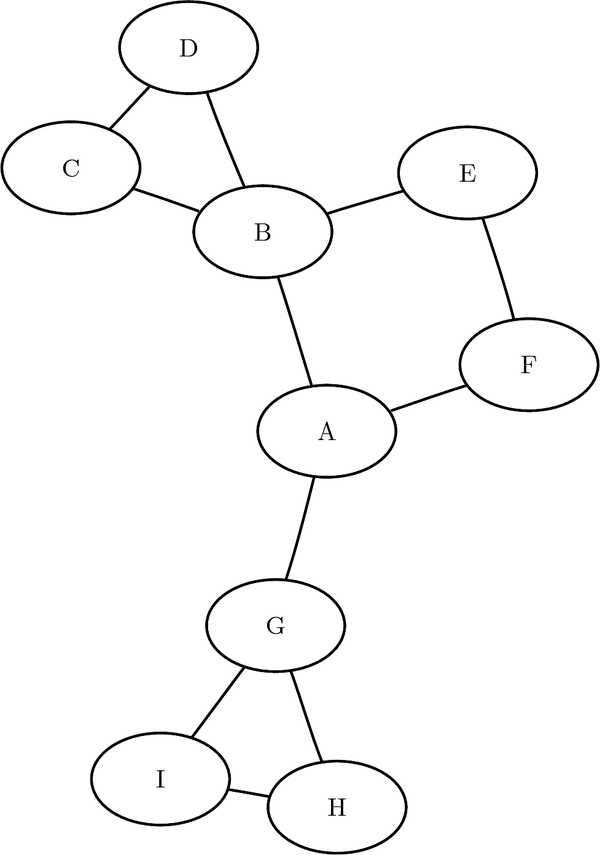

   

   以下语句计算重连通分量和关节点，并输出结果的数据集`LINKSETOUT`和`NODESETOUT`：

   ```SAS
   PROC OPTGRAPH
      DATA_LINKS = LINKSETINBICC
      OUT_LINKS  = LINKSETOUT
      OUT_NODES  = NODESETOUT;
      BICONCOMP;
   RUN;
   ```

   数据集`LINKSETOUT`:

   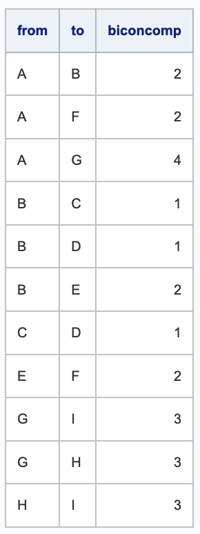

   数据集`NODESETOUT`:

   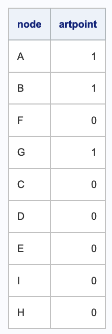

   结果解释：

   数据集`LINKSETOUT`，即根据关联关系分团，得到团号**biconcomp** 1、2、3、4对应$C^1、C^2、C^3、C^4$：

   $C^1=\{{B,C,D}\}$:

   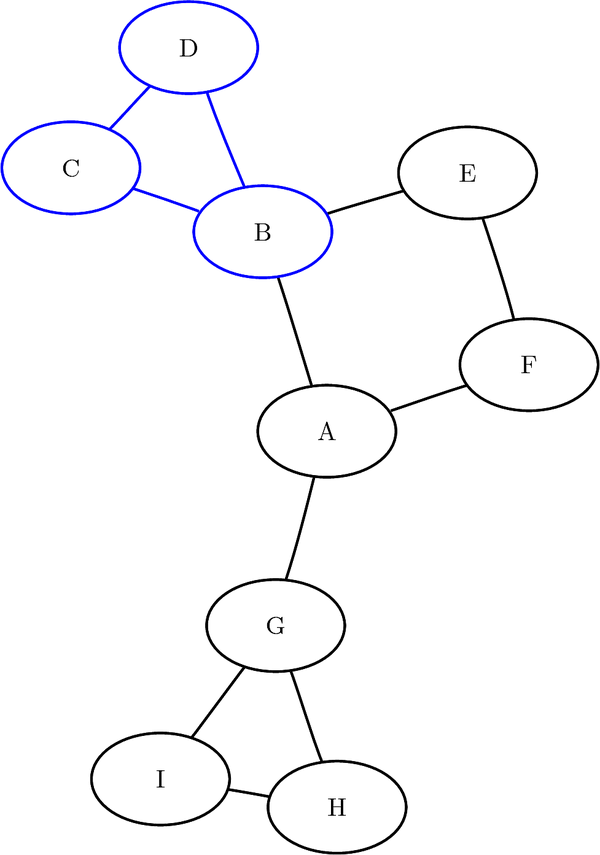

   $C^2=\{{A,B,E,F}\}$:

   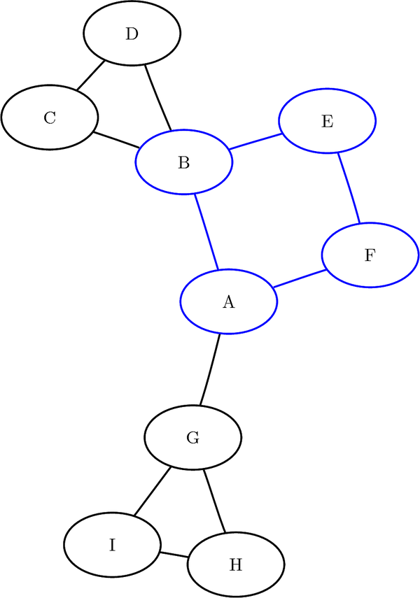

   $C^3=\{{G,H,I}\}$:

   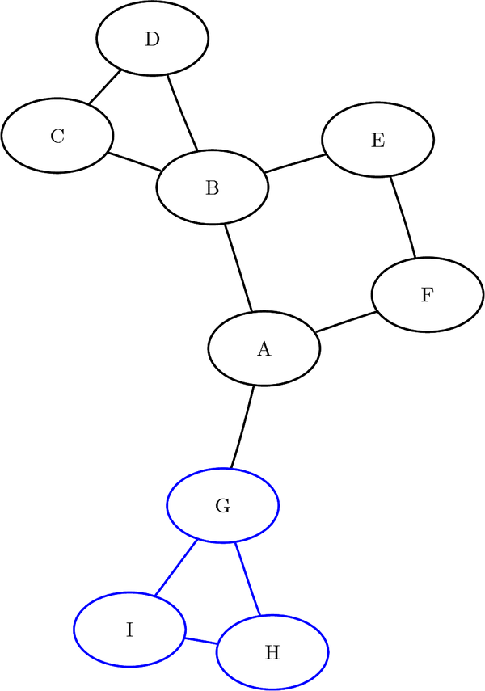

   $C^4=\{{A,G}\}$:

   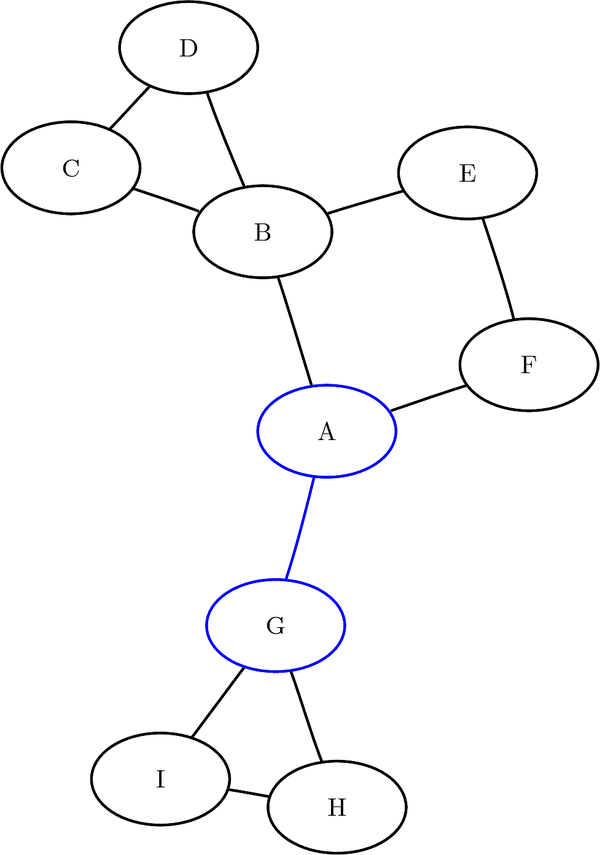

   数据集`NODESETOUT`，得到关节点A、B、G，即`代码4`中**artpoint**=1的点，并据此拆分。

#### 三、综述

据此方法，将非重连通图的大规模SNA团，根据关节点进行网络切割。


