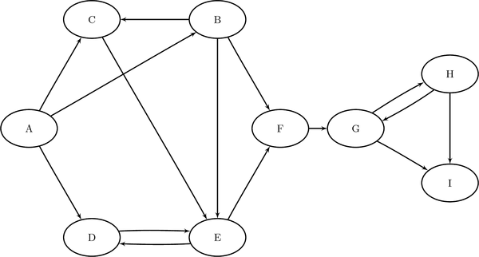
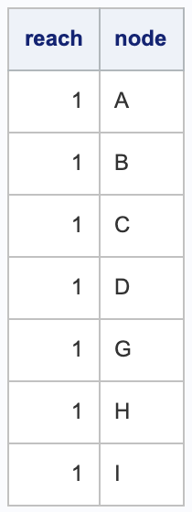
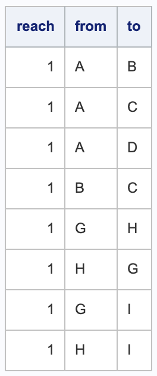
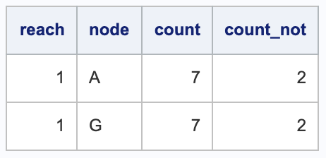
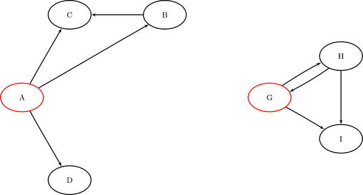
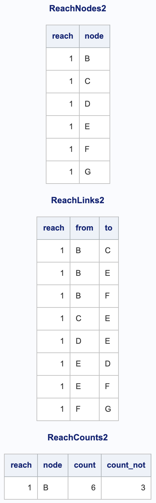
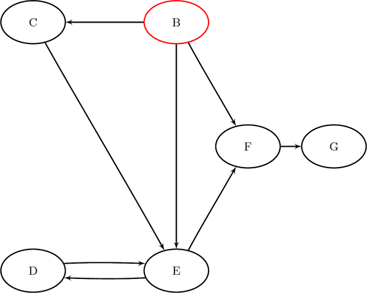

#### Reach (Ego) Network

PROC OPTGRAPH过程步，包括许多图形理论、组合优化和网络分析算法。
参考[SAS Help](http://documentation.sas.com/?docsetId=procgralg&docsetTarget=procgralg_optgraph_details15.htm&docsetVersion=15.1&locale=zh-CN)，算法种类见下表：


以下简述Reach (Ego) Network 到达网络：

有向图G存在以下关系链接，



```SAS
DATA LINKSETIN;
   INPUT FROM $ TO $ @@;
   DATALINES;
A B  A C  A D  B C  B E
B F  C E  D E  E D  E F
F G  G H  G I  H G  H I
;
```

设计两组源节点，$S_1=\{A,G\}, S_2=\{B\}$,

```SAS
DATA NODESUBSETIN1;
   INPUT NODE $ REACH;
   DATALINES;
A 1
G 1
;

DATA NODESUBSETIN2;
   INPUT NODE $ REACH;
   DATALINES;
B 1
;
```

对于**第一组**源节点，可以使用以下语句来计算跳数限制为1的到达网络：

```sas
PROC OPTGRAPH
		/* DIRECTED UNDIRECTED */
   GRAPH_DIRECTION = DIRECTED
   DATA_LINKS      = LINKSETIN
   DATA_NODES_SUB  = NODESUBSETIN1;
   REACH
      OUT_NODES    = REACHNODES1
      OUT_LINKS    = REACHLINKS1
      OUT_COUNTS   = REACHCOUNTS1
      MAXREACH     = 1;
RUN;
```

返回结果

`REACHNODES1` 节点:



`REACHLINKS1`关系:



`REACHCOUNTS1`计数:



即**第一组**源节点的到达网络，如图：



同样的，对于**第二组**源节点，可以使用以下语句来计算跳数限制为2的到达网络：

```sas
PROC OPTGRAPH
		/* DIRECTED UNDIRECTED */
   GRAPH_DIRECTION = DIRECTED
   DATA_LINKS      = LINKSETIN
   DATA_NODES_SUB  = NODESUBSETIN2;
   REACH
      OUT_NODES    = REACHNODES2
      OUT_LINKS    = REACHLINKS2
      OUT_COUNTS   = REACHCOUNTS2
      MAXREACH     = 2;
RUN;
```

结果如下：



即**第二组**源节点的到达网络，如图：



可以看到，上述例子，**源节点的原表设计REACH不论在MAXREACH = 1 or 2都没有本质区别**，对此：

```
You can process a set of reach networks from one graph in one pass using one node subset data set. The MAXREACH= option applies to all of the reach networks requested. If the node subset data set column reach is set to 0 or missing (.), then the node is not processed. If the column reach is set to a value greater than 0, then the node is processed with other nodes by using the same marker.
```

即

1. 缺失，不允处理；

2. 可设计不同值；

有例：

```SAS
DATA NODESUBSETIN;
   INPUT NODE $ REACH;
   DATALINES;
A 2
C 1
H 2
;

PROC OPTGRAPH
   GRAPH_DIRECTION = DIRECTED
   DATA_LINKS      = LINKSETIN
   DATA_NODES_SUB  = NODESUBSETIN;
   REACH
      OUT_NODES    = REACHNODES
      OUT_LINKS    = REACHLINKS
      OUT_COUNTS   = REACHCOUNTS
      MAXREACH     = 1;
RUN;
```

另外的，还可以引进**集群**的概念，通过`BY CLUSTER`实现。