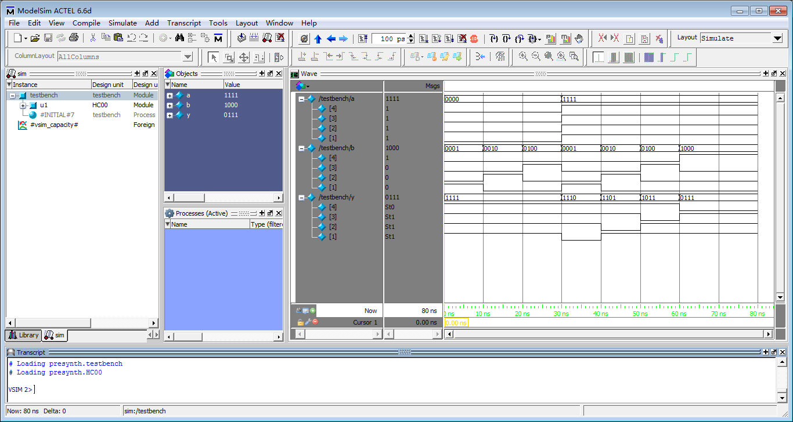
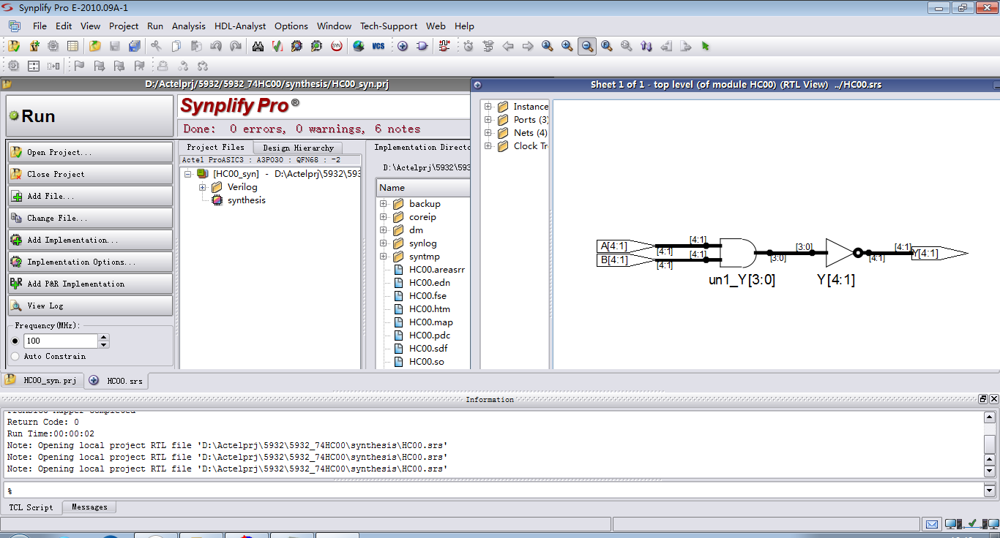
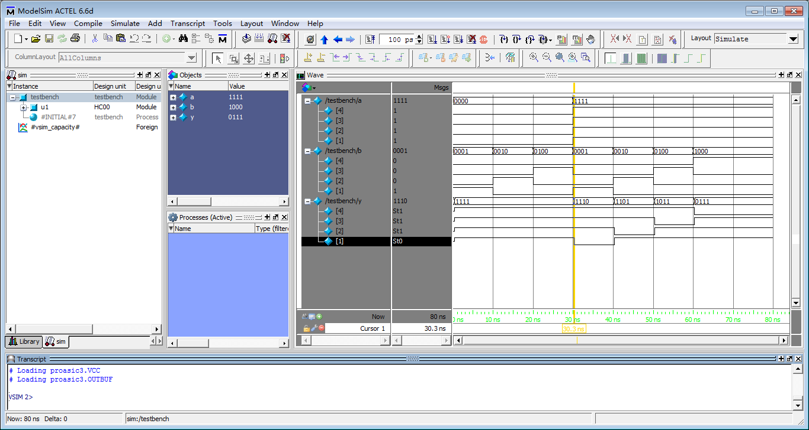
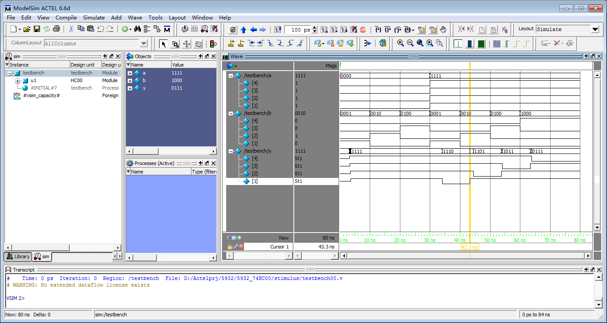

> FPGA, By Actelprj, @5932.

**文档结构：**

```
04.FPGA
> 5932_00_153_194/
> 5932_74HC00/
> 5932_74HC02/
> 5932_74HC04/
> 5932_74HC08/
> 5932_74HC112/
> 5932_74HC138/
> 5932_74HC148/
> 5932_74HC153/
> 5932_74HC161/
> 5932_74HC194/
> 5932_74HC283/
> 5932_74HC32/
> 5932_74HC4511/
> 5932_74HC74/
> 5932_74HC85/
> 5932_74HC86/
> 5932_digi_disp/
> 5932_extend_coder/
> 5932_keyscan_coder/
> 5932_lights/
> 5932_sign_cmp/
> 5932_traf_ctl/
```

**文档目录：**

```
> 一、基本门电路
> 二、组合逻辑电路
> 三、时序逻辑电路
> 四、基本门电路、组合电路和时序电路的程序烧录及验证
> 五、数字逻辑综合设计仿真及验证
```

**基础简介：**

> FPGA（Field Programmable Gate Array）是在PAL、GAL等可编程器件的基础上进一步发展的产物。它是作为[专用集成电路](https://baike.baidu.com/item/专用集成电路/6908931)（ASIC）领域中的一种半定制电路而出现的，既解决了定制电路的不足，又克服了原有可编程器件门电路数有限的缺点。
>
> FPGA设计不是简单的芯片研究，主要是利用 FPGA 的模式进行其他行业产品的设计。 与 ASIC 不同，FPGA在通信行业的应用比较广泛。通过对全球FPGA产品市场以及相关供应商的分析，结合当前我国的实际情况以及国内领先的FPGA产品可以发现相关技术在未来的发展方向，对我国科技水平的全面提高具有非常重要的推动作用。
>
> 与传统模式的芯片设计进行对比，FPGA 芯片并非单纯局限于研究以及设计芯片，而是针对较多领域产品都能借助特定芯片模型予以优化设计。从芯片器件的角度讲，FPGA 本身构成 了半定制电路中的典型[集成电路](https://baike.baidu.com/item/集成电路/108211)，其中含有数字管理模块、内嵌式单元、输出单元以及输入单元等。在此基础上，关于FPGA芯片有必要全面着眼于综合性的芯片优化设计，通过改进当前的芯片设计来增设全新的芯片功能，据此实现了芯片整体构造的简化与性能提升。

**正文内容：**

#### 一、基本门电路

- 实验内容 

1. 掌握Libero软件的使用方法；
2. 进行针对74系列基本门电路的设计，并完成相应的仿真实验；
3. 参考教材中相应章节的设计代码、测试平台代码（可自行编程），完成74HC00、74HC02、74HC04、74HC08、74HC32、74HC86相应的设计、综合及仿真；
4. 提交针对74HC00、74HC02、74HC04、74HC08、74HC32、74HC86的综合结果，以及相应的仿真结果；


- 实验结果

1. 所有模块及测试平台代码清单

```verilog
// 74HC00代码-与非
// 5932_74HC00.v
module HC00(A,B,Y);
input [4:1]A,B;
output [4:1]Y;
assign Y=~(A&B);//74HC00 与非 数据流风格
endmodule
```

```verilog
// 74HC00测试平台代码
// testbench00.v
`timescale 1ns/1ns
module testbench();
reg[4:1]a,b;
wire[4:1]y;
HC00 u1(a,b,y);
initial
begin
a=4'b0000;b=4'b0001;
#10 b=b<<1;
#10 b=b<<1;
#10 b=b<<1;
a=4'b1111;b=4'b0001;
#10 b=b<<1;
#10 b=b<<1;
#10 b=b<<1;
end
endmodule
```

```verilog
// 74HC02代码-或非
// 5932_74HC02.v
module HC02(A,B,Y);
input [4:1]A,B;
output [4:1]Y;
assign Y=~(A|B);//74HC02 或非 数据流风格
endmodule
```

```verilog
// 74HC02测试平台代码
// testbench02.v
`timescale 1ns/1ns
module testbench();
reg[4:1]a,b;
wire[4:1]y;
HC02 u1(a,b,y);
initial
begin
a=4'b0000;b=4'b0001;
#10 b=b<<1;
#10 b=b<<1;
#10 b=b<<1;
a=4'b1111;b=4'b0001;
#10 b=b<<1;
#10 b=b<<1;
#10 b=b<<1;
end
endmodule
```

```verilog
// 74HC04代码-非
// 5932_74HC04.v
module HC04(A,Y);
input wire[6:1]A;
output wire[6:1]Y;
not 
gate1(Y[1],A[1]),
gate2(Y[2],A[2]),
gate3(Y[3],A[3]),
gate4(Y[4],A[4]),
gate5(Y[5],A[5]),
gate6(Y[6],A[6]);
//74HC04 非 门级风格
endmodule
```

```verilog
// 74HC04测试平台代码
// testbench04.v
`timescale 1ns/1ns
module testbench();
reg[6:1]a;
wire[6:1]y;
HC04 u1(a,y);
initial
begin
a=6'b000001;
#10 a=a<<1;
#10 a=a<<1;
#10 a=a<<1;
#10 a=a<<1;
#10 a=a<<1;
#10 a=a<<1;
end
endmodule
```

```verilog
// 74HC08代码-与
// 5932_74HC08.v
module HC08(A,B,Y);
input wire[4:1]A,B;
output wire[4:1]Y;
and
gate1(Y[1],A[1],B[1]),
gate2(Y[2],A[2],B[2]),
gate3(Y[3],A[3],B[3]),
gate4(Y[4],A[4],B[4]);//74HC08 与 门级风格
endmodule
```

```verilog
// 74HC08测试平台代码
// testbench08.v
`timescale 1ns/1ns
module testbench();
reg[4:1]a,b;
wire[4:1]y;
HC08 u1(a,b,y);
initial
begin
a=4'b1111;b=4'b0001;
#10 b=b<<1;
#10 b=b<<1;
#10 b=b<<1;
end
endmodule
```

```verilog
// 74HC32代码-或
// 5932_74HC32.v
module HC32(A,B,Y);
input wire[4:1]A,B;
output wire[4:1]Y;
or
gate1(Y[1],A[1],B[1]),
gate2(Y[2],A[2],B[2]),
gate3(Y[3],A[3],B[3]),
gate4(Y[4],A[4],B[4]);//74HC32 或 门级风格
endmodule
```

```verilog
// 74HC32测试平台代码
// testbench32.v
`timescale 1ns/1ns
module testbench();
reg[4:1]a,b;
wire[4:1]y;
HC32 u1(a,b,y);
initial
begin
a=4'b0000;b=4'b0001;
#10 b=b<<1;
#10 b=b<<1;
#10 b=b<<1;
end
endmodule
```

```verilog
// 74HC86代码-异或
// 5932_74HC86.v
module HC86(A,B,Y);
input [4:1]A,B;
output [4:1]Y;
reg [4:1]Y;
always @(A,B)   //74HC86 异或 行为风格
  Y=A^B;
endmodule
```

```verilog
// 74HC86测试平台代码
// testbench86.v
`timescale 1ns/1ns
module testbench();
reg[4:1]a,b;
wire[4:1]y;
HC86 u1(a,b,y);
initial
begin
a=4'b0000;b=4'b0001;
#10 b=b<<1;
#10 b=b<<1;
#10 b=b<<1;
a=4'b1111;b=4'b0001;
#10 b=b<<1;
#10 b=b<<1;
#10 b=b<<1;
end
endmodule
```


2. 仿真结果










#### 二、组合逻辑电路

1

#### 三、时序逻辑电路

1

#### 四、基本门电路、组合电路和时序电路的程序烧录及验证

1

#### 五、数字逻辑综合设计仿真及验证

1


