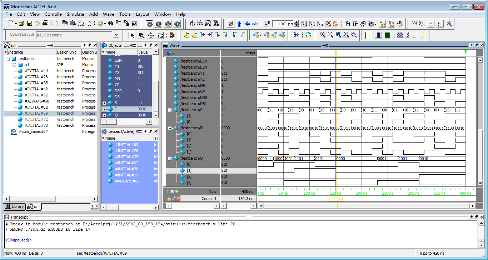
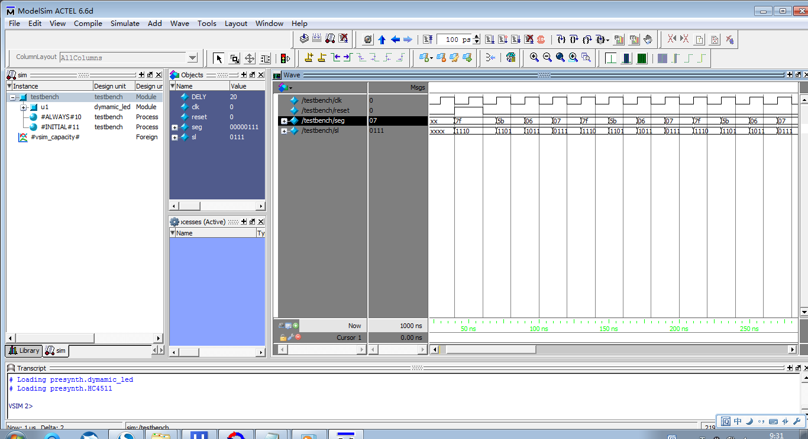

> https://www.fpga4fun.com/

> FPGA, By Actelprj, @5932.

**文档结构：**

```
04.FPGA
> 5932_00_153_194/
> 5932_74HC00/
> 5932_74HC02/
> 5932_74HC04/
> 5932_74HC08/
> 5932_74HC112/
> 5932_74HC138/
> 5932_74HC148/
> 5932_74HC153/
> 5932_74HC161/
> 5932_74HC194/
> 5932_74HC283/
> 5932_74HC32/
> 5932_74HC4511/
> 5932_74HC74/
> 5932_74HC85/
> 5932_74HC86/
> 5932_digi_disp/
> 5932_extend_coder/
> 5932_keyscan_coder/
> 5932_lights/
> 5932_sign_cmp/
> 5932_traf_ctl/
```

**文档目录：**

```
> 一、基本门电路
> 二、组合逻辑电路
> 三、时序逻辑电路
> 四、基本门电路、组合电路和时序电路的程序烧录及验证
> 五、数字逻辑综合设计仿真及验证
```

**基础简介：**

> FPGA（Field Programmable Gate Array）是在PAL、GAL等可编程器件的基础上进一步发展的产物。它是作为[专用集成电路](https://baike.baidu.com/item/专用集成电路/6908931)（ASIC）领域中的一种半定制电路而出现的，既解决了定制电路的不足，又克服了原有可编程器件门电路数有限的缺点。
>
> FPGA设计不是简单的芯片研究，主要是利用 FPGA 的模式进行其他行业产品的设计。 与 ASIC 不同，FPGA在通信行业的应用比较广泛。通过对全球FPGA产品市场以及相关供应商的分析，结合当前我国的实际情况以及国内领先的FPGA产品可以发现相关技术在未来的发展方向，对我国科技水平的全面提高具有非常重要的推动作用。
>
> 与传统模式的芯片设计进行对比，FPGA 芯片并非单纯局限于研究以及设计芯片，而是针对较多领域产品都能借助特定芯片模型予以优化设计。从芯片器件的角度讲，FPGA 本身构成 了半定制电路中的典型[集成电路](https://baike.baidu.com/item/集成电路/108211)，其中含有数字管理模块、内嵌式单元、输出单元以及输入单元等。在此基础上，关于FPGA芯片有必要全面着眼于综合性的芯片优化设计，通过改进当前的芯片设计来增设全新的芯片功能，据此实现了芯片整体构造的简化与性能提升。

**正文内容：**

#### 一、基本门电路

- 实验内容 

1. 掌握Libero软件的使用方法；
2. 进行针对74系列基本门电路的设计，并完成相应的仿真实验；
3. 参考教材中相应章节的设计代码、测试平台代码（可自行编程），完成74HC00、74HC02、74HC04、74HC08、74HC32、74HC86相应的设计、综合及仿真；
4. 提交针对74HC00、74HC02、74HC04、74HC08、74HC32、74HC86的综合结果，以及相应的仿真结果；


- 实验结果

1. 所有模块及测试平台代码清单

```verilog
// 74HC00代码-与非
// 5932_74HC00.v
module HC00(A,B,Y);
input [4:1]A,B;
output [4:1]Y;
assign Y=~(A&B);//74HC00 与非 数据流风格
endmodule
```

```verilog
// 74HC00测试平台代码
// testbench00.v
`timescale 1ns/1ns
module testbench();
reg[4:1]a,b;
wire[4:1]y;
HC00 u1(a,b,y);
initial
begin
a=4'b0000;b=4'b0001;
#10 b=b<<1;
#10 b=b<<1;
#10 b=b<<1;
a=4'b1111;b=4'b0001;
#10 b=b<<1;
#10 b=b<<1;
#10 b=b<<1;
end
endmodule
```

```verilog
// 74HC02代码-或非
// 5932_74HC02.v
module HC02(A,B,Y);
input [4:1]A,B;
output [4:1]Y;
assign Y=~(A|B);//74HC02 或非 数据流风格
endmodule
```

```verilog
// 74HC02测试平台代码
// testbench02.v
`timescale 1ns/1ns
module testbench();
reg[4:1]a,b;
wire[4:1]y;
HC02 u1(a,b,y);
initial
begin
a=4'b0000;b=4'b0001;
#10 b=b<<1;
#10 b=b<<1;
#10 b=b<<1;
a=4'b1111;b=4'b0001;
#10 b=b<<1;
#10 b=b<<1;
#10 b=b<<1;
end
endmodule
```

```verilog
// 74HC04代码-非
// 5932_74HC04.v
module HC04(A,Y);
input wire[6:1]A;
output wire[6:1]Y;
not 
gate1(Y[1],A[1]),
gate2(Y[2],A[2]),
gate3(Y[3],A[3]),
gate4(Y[4],A[4]),
gate5(Y[5],A[5]),
gate6(Y[6],A[6]);
//74HC04 非 门级风格
endmodule
```

```verilog
// 74HC04测试平台代码
// testbench04.v
`timescale 1ns/1ns
module testbench();
reg[6:1]a;
wire[6:1]y;
HC04 u1(a,y);
initial
begin
a=6'b000001;
#10 a=a<<1;
#10 a=a<<1;
#10 a=a<<1;
#10 a=a<<1;
#10 a=a<<1;
#10 a=a<<1;
end
endmodule
```

```verilog
// 74HC08代码-与
// 5932_74HC08.v
module HC08(A,B,Y);
input wire[4:1]A,B;
output wire[4:1]Y;
and
gate1(Y[1],A[1],B[1]),
gate2(Y[2],A[2],B[2]),
gate3(Y[3],A[3],B[3]),
gate4(Y[4],A[4],B[4]);//74HC08 与 门级风格
endmodule
```

```verilog
// 74HC08测试平台代码
// testbench08.v
`timescale 1ns/1ns
module testbench();
reg[4:1]a,b;
wire[4:1]y;
HC08 u1(a,b,y);
initial
begin
a=4'b1111;b=4'b0001;
#10 b=b<<1;
#10 b=b<<1;
#10 b=b<<1;
end
endmodule
```

```verilog
// 74HC32代码-或
// 5932_74HC32.v
module HC32(A,B,Y);
input wire[4:1]A,B;
output wire[4:1]Y;
or
gate1(Y[1],A[1],B[1]),
gate2(Y[2],A[2],B[2]),
gate3(Y[3],A[3],B[3]),
gate4(Y[4],A[4],B[4]);//74HC32 或 门级风格
endmodule
```

```verilog
// 74HC32测试平台代码
// testbench32.v
`timescale 1ns/1ns
module testbench();
reg[4:1]a,b;
wire[4:1]y;
HC32 u1(a,b,y);
initial
begin
a=4'b0000;b=4'b0001;
#10 b=b<<1;
#10 b=b<<1;
#10 b=b<<1;
end
endmodule
```

```verilog
// 74HC86代码-异或
// 5932_74HC86.v
module HC86(A,B,Y);
input [4:1]A,B;
output [4:1]Y;
reg [4:1]Y;
always @(A,B)   //74HC86 异或 行为风格
  Y=A^B;
endmodule
```

```verilog
// 74HC86测试平台代码
// testbench86.v
`timescale 1ns/1ns
module testbench();
reg[4:1]a,b;
wire[4:1]y;
HC86 u1(a,b,y);
initial
begin
a=4'b0000;b=4'b0001;
#10 b=b<<1;
#10 b=b<<1;
#10 b=b<<1;
a=4'b1111;b=4'b0001;
#10 b=b<<1;
#10 b=b<<1;
#10 b=b<<1;
end
endmodule
```


2. 仿真结果


#### 二、组合逻辑电路

- 实验内容 

1. 掌握Libero软件的使用方法；
2. 进行针对74系列基本组合逻辑电路的设计，并完成相应的仿真实验；
3. 参考教材中相应章节的设计代码、测试平台代码（可自行编程），完成74HC148、74HC138、74HC153、74HC85、74HC283、74HC4511相应的设计、综合及仿真；
4. 74HC4511设计成扩展型的，即能显示数字0~9、字母a~f；
5. 提交针对74HC148、74HC138、74HC153、74HC85、74HC283、74HC4511的综合结果，以及相应的仿真结果；


- 实验结果

1. 所有模块及测试平台代码清单

```verilog
// 74HC148代码
// 5932_74HC148.v
module HC148(DataIn,EO,Dataout,EI,GS);
input [7:0]DataIn;input EI;output EO;output [2:0]Dataout;output GS;
reg [2:0]Dataout;reg EO;reg GS;integer I;

always@(DataIn or EI)
 begin:local
  if(EI)
   begin
    Dataout=7;
    EO=1;
    GS=1;
   end
  else if(DataIn==16'b11111111)
   begin
    Dataout=7;
    EO=0;
    GS=1;
   end
  else
  begin
   for(I=0;I<8;I=I+1)
    begin
     if(~DataIn[I])
      begin 
       Dataout=~I;
       EO=1;
       GS=0;
      end
    end
  end
 end
endmodule
```

```verilog
// 74HC148测试平台代码
// testbench148.v
`timescale 1ns/10ps
module testbench();
reg[7:0]DataIn;reg EI;
wire[2:0]Dataout;

HC148 u1(DataIn,EO,Dataout,EI,GS);
initial
begin
  DataIn=0;
  repeat(20)
  #20 DataIn=$random;
end

initial
 begin
  EI=1;
  #20 EI=0;
 end
endmodule
```

```verilog
// 74HC138代码
// 5932_74HC138.v
module HC138(DataIn,Dataout,G1,G2AN,G2BN);
input[2:0]DataIn;
input G1,G2AN,G2BN;
output[7:0]Dataout;
reg[7:0]Dataout;
wire[2:0]DataIn;
integer I;

always@(DataIn or G1 or G2AN or G2BN)
 begin
  if(~G1|~(G2AN&G2BN))
   Dataout=0;
  else
   for(I=0;I<=7;I=I+1)
    if(DataIn==I)
     Dataout[I]=0;
    else
     Dataout[I]=1;
 end
endmodule
```

```verilog
// 74HC138测试平台代码
// testbench138.v
`timescale 1ns/10ps
module testbench();
reg[2:0]DataIn;reg G1,G2AN,G2BN;
wire[7:0]Dataout;

HC138 u1(DataIn,Dataout,G1,G2AN,G2BN);
initial
begin
  DataIn=0;
  repeat(20)
  #20 DataIn=$random;
end

initial
 begin
  G1=0;
  #40 G1=1;
end

initial
 begin
  G2AN=0;
  #20 G2AN=1;
end

initial
 begin
  G2BN=0;
  #40 G2BN=1;
end
endmodule
```

```verilog
// 74HC153代码
// 5932_74HC153.v
module HC153(I1,I2,S1,S2,E1N,E2N,Y1,Y2);
input[0:3]I1;input[0:3]I2;
input S1,S2;
input E1N,E2N;
output Y1,Y2;
reg Y1,Y2;

always@(I1 or I2 or S1 or S2 or E1N or E2N)
begin:local
 if(E1N)
  Y1=0;
 else
  begin
   case({S1,S2})
    0:Y1=I1[0];
    1:Y1=I1[1];
    2:Y1=I1[2];
    3:Y1=I1[3];
    default:Y1=1'bx;
   endcase
  end

 if(E2N)
  Y2=0;
 else
  begin
   case({S1,S2})
    0:Y2=I2[0];
    1:Y2=I2[1];
    2:Y2=I2[2];
    3:Y2=I2[3];
    default:Y2=1'bx;
   endcase
  end
 end
endmodule
```

```verilog
// 74HC153测试平台代码
// testbench153.v
`timescale 1ns/10ps
module testbench();
reg[0:3]I1;reg[0:3]I2;
reg S1,S2,E1N,E2N;
wire Y1,Y2;

HC153 u1(I1,I2,S1,S2,E1N,E2N,Y1,Y2);
initial
begin
 I1=0;
 repeat(20)
  #20 I1=$random;
end

initial
begin
 I2=0;
 repeat(20)
  #20 I2=$random;
end

initial
 begin
  S1=0;S2=0;
  #20 S1=0;S2=1;
  #100 S1=1;S2=0;
  #100 S1=1;S2=1;
  #100 S1=0;S2=0;
  #100;
end

initial
begin
 E1N=1;E2N=1;
 #20 E1N=0;E2N=0;
end
endmodule
```

```verilog
// 74HC85代码
// 5932_74HC85.v
module HC85(A,B,QAGB,QASB,QAEB,IAGB,IASB,IAEB);
input[3:0]A,B;
input IAGB,IASB,IAEB;
output QAGB,QASB,QAEB;
reg QAGB,QASB,QAEB;

always@(A or B or IAGB or IASB or IAEB)
 begin
  
  if(A>B)
   begin 
    QAGB=1;QASB=0;QAEB=0;
   end
  
  else if(A<B)
   begin 
    QAGB=0;QASB=1;QAEB=0;
   end
  
  else if(IAGB&!IASB&!IAEB)
   begin 
    QAGB=1;QASB=0;QAEB=0;
   end
  
  else if(!IAGB&IASB&!IAEB)
   begin 
    QAGB=0;QASB=1;QAEB=0;
   end
    
  else if(IAEB)
   begin 
    QAGB=1;QASB=0;QAEB=0;
   end
  
  else if(IAGB&IASB&!IAEB)
   begin 
    QAGB=0;QASB=0;QAEB=0;
   end
  
  else if(!IAGB&!IASB&!IAEB)
   begin 
    QAGB=1;QASB=1;QAEB=0;
   end
 end
endmodule
```

```verilog
// 74HC85测试平台代码
// testbench85.v
// A数依次取学号从左到右的奇数位，即数字3,1,0,5,3
// B数依次取学号从左到右的偶数位，即数字1,2,0,9,2
`timescale 1ns/10ps
module testbench();
reg[3:0]A,B;
reg IAGB,IASB,IAEB;
wire QAGB,QASB,QAEB;


HC85 u1(A,B,QAGB,QASB,QAEB,IAGB,IASB,IAEB);
initial
 begin
 A=0;B=0;
 IAGB=1;IASB=1;IAEB=1;
 #20 
  A=3;B=1;
 
 #20 
  A=1;B=2;

 #20
  A=0;B=0;
  IAGB=0;IASB=0;IAEB=0;
 
 #20 IAGB=0;IASB=0;IAEB=1;
 #20 IAGB=1;IASB=0;IAEB=0;
 #20 IAGB=1;IASB=0;IAEB=1;
 
 #20 IAGB=0;IASB=1;IAEB=0;
 #20 IAGB=0;IASB=1;IAEB=1;
 #20 IAGB=1;IASB=1;IAEB=0;
 #20 IAGB=1;IASB=1;IAEB=1;


 #20
  A=5;B=9;
 
 #20
  A=3;B=2;
 
 end
endmodule
```

```verilog
// 74HC283代码
// 5932_74HC283.v
module HC283(sum,cout,a,b,cin,shiftedcarry);
output[3:0]sum;
output[4:0]shiftedcarry;
output cout;
input[3:0]a,b;
input cin;
reg[3:0]carrychain;
wire[3:0]g=a&b;
wire[3:0]p=a^b;

always@(a or b or cin or p or g)
 begin:carry_generation
  integer i;
  carrychain[0]=g[0]+(p[0]&cin);
  for(i=1;i<=3;i=i+1)
   carrychain[i]=g[i]|(p[i]&carrychain[i-1]);
 end
wire[4:0]shiftedcarry={carrychain,cin};
wire[3:0]sum=p^shiftedcarry;
wire cout=shiftedcarry[4];
endmodule
```

```verilog
// 74HC283测试平台代码
// testbench283.v
`timescale 1ns/10ps
module testbench();
reg[3:0]a,b;reg cin; 
wire[3:0]sum;
wire[4:0]shiftedcarry;
wire cout;

HC283 u1(sum,cout,a,b,cin,shiftedcarry);
initial
begin
  a=0;
  repeat(20)
   #20 a=$random;
end

initial
begin
  b=0;
  repeat(20)
   #20 b=$random;
end

initial
begin
  cin=0;
   #200 cin=1;
end
endmodule
```

```verilog
// 74HC4511代码
// 5932_74HC4511.v
module HC4511(A,Seg,LT_N,BI_N,LE);
input LT_N,BI_N,LE;
input[3:0]A;
output[7:0]Seg;
reg[7:0]SM_8S;
assign Seg=SM_8S;

always@(A or LT_N or  BI_N or LE )
 begin
  if(!LT_N)SM_8S=8'b11111111;
  else if(!BI_N)SM_8S=8'b00000000;
  else if(LE)SM_8S=SM_8S;
  else
   case(A)
    4'd0:SM_8S=8'b00111111;
    4'd1:SM_8S=8'b00000110;
    4'd2:SM_8S=8'b01011011;
    4'd3:SM_8S=8'b01001111;
    4'd4:SM_8S=8'b01100110;
    4'd5:SM_8S=8'b01101101;
    4'd6:SM_8S=8'b01111101;
    4'd7:SM_8S=8'b00000111;
    4'd8:SM_8S=8'b01111111;
    4'd9:SM_8S=8'b01101111;
    4'd10:SM_8S=8'b01110111;
    4'd11:SM_8S=8'b01111100;
    4'd12:SM_8S=8'b00111001;
    4'd13:SM_8S=8'b01011110;
    4'd14:SM_8S=8'b01111001;
    4'd15:SM_8S=8'b01110001;
    default:;
  endcase
 end
endmodule
```

```verilog
// 74HC4511测试平台代码
// testbench4511.v
`timescale 1ns/10ps
module testbench();
reg LT_N,BI_N,LE;
reg[3:0]A;
wire[7:0]Seg;

HC4511 u1(A,Seg,LT_N,BI_N,LE);
initial
 begin
  A=0;
  repeat(20)
  #20 A=$random;
 end

initial
 begin
  LT_N=0;BI_N=0;LE=1;
  #20 LT_N=1;BI_N=1;LE=0;
 end
endmodule
```


2. 仿真结果


#### 三、时序逻辑电路

- 实验内容 

1. 掌握Libero软件的使用方法；
2. 进行针对74系列基本门电路的设计，并完成相应的仿真实验；
3. 参考教材中相应章节的设计代码、测试平台代码（可自行编程），完成74HC74、74HC112、74HC161、74HC194相应的设计、综合及仿真；
4. 提交针对74HC74、74HC112、74HC161、74HC194的综合结果，以及相应的仿真结果；


- 实验结果

1. 所有模块及测试平台代码清单

```verilog
// 74HC74代码
// 5932_74HC74.v
module HC74(D,Clk,Q,SD,RD,QN);
input [1:2]D,Clk,SD,RD;
output [1:2]Q,QN;
reg [1:2]Q;
assign QN=~Q;

always@(posedge Clk[1] or negedge RD[1] or negedge SD[1])
 case({RD[1],SD[1]})
  2'b00:Q[1]<=1;
  2'b01:Q[1]<=0;
  2'b10:Q[1]<=1;
  2'b11:Q[1]<=D[1];
 endcase

always@(posedge Clk[2] or negedge RD[2] or negedge SD[2])
 case({RD[2],SD[2]})
  2'b00:Q[2]<=1;
  2'b01:Q[2]<=0;
  2'b10:Q[2]<=1;
  2'b11:Q[2]<=D[2];
 endcase

endmodule
```

```verilog
// 74HC74测试平台代码
// textbench74.v
`timescale 1ns/1ns
module testbench;
reg [1:2]D,Clk,SD,RD;
wire [1:2]Q,QN;
parameter clock_period=20;
always#(clock_period/2)Clk=~Clk;

initial
 begin
  D=0;Clk=0;
  repeat(20)
   #20 D=$random;
 end

initial
 #400 $finish;

initial
 begin
  SD=2'b00;RD=2'b00;
  #20 SD=2'b00;RD=2'b11;
  #20 SD=2'b11;RD=2'b00;
  #20 SD=2'b11;RD=2'b11;
 end

HC74 u1(D,Clk,Q,SD,RD,QN);
endmodule
```

```verilog
// 74HC112代码
// 5932_74HC112.v
module HC112(J,K,Clk,SD,RD,Q,QN);
input [1:2]J,K,Clk,SD,RD;
output [1:2]Q,QN;
reg [1:2]Q;
assign QN=~Q;

always@(negedge Clk[1] or negedge RD[1] or negedge SD[1])
 case({RD[1],SD[1]})
  2'b00:Q[1]<=1;
  2'b01:Q[1]<=0;
  2'b10:Q[1]<=1;
  2'b11:
   case({J[1],K[1]})
    2'b00:Q[1]<=Q[1];
    2'b01:Q[1]<=0;
    2'b10:Q[1]<=1;
    2'b11:Q[1]<=~Q[1];
   endcase
 endcase

always@(negedge Clk[2] or negedge RD[2] or negedge SD[2])
 case({RD[2],SD[2]})
  2'b00:Q[2]<=1;
  2'b01:Q[2]<=0;
  2'b10:Q[2]<=1;
  2'b11:
   case({J[2],K[2]})
    2'b00:Q[2]<=Q[2];
    2'b01:Q[2]<=0;
    2'b10:Q[2]<=1;
    2'b11:Q[2]<=~Q[2];
   endcase
 endcase

endmodule
```

```verilog
// 74HC112测试平台代码
// textbench112.v
`timescale 1ns/1ns
module testbench;
reg [1:2]J,K,Clk,SD,RD;
wire [1:2]Q,QN;
parameter clock_period=20;
always#(clock_period/2)Clk=~Clk;

initial
 begin
  J=0;K=0;Clk=0;
//repeat(20)#20 {J,K}=$random;
  #60 J=0;K=0;
  #20 J=0;K=1;
  #20 J=0;K=2;
  #20 J=0;K=3;
  #20 J=1;K=0;
  #20 J=1;K=1;
  #20 J=1;K=2;
  #20 J=1;K=3;
  #20 J=2;K=0;
  #20 J=2;K=1;
  #20 J=2;K=2;
  #20 J=2;K=3;
  #20 J=3;K=0;
  #20 J=3;K=1;
  #20 J=3;K=2;
  #20 J=3;K=3;
 end

initial
 #400 $finish;

initial
 begin
  SD=2'b00;RD=2'b00;
  #20 SD=2'b00;RD=2'b11;
  #20 SD=2'b11;RD=2'b00;
  #20 SD=2'b11;RD=2'b11;
 end

HC112 u1(J,K,Clk,SD,RD,Q,QN);
endmodule
```

```verilog
// 74HC161代码
// 5932_74HC161.v
module HC161(MR,CP,CEP,CET,PE,D,Q,TC);
input MR,CP,CEP,CET,PE;input[0:3]D;
output[0:3]Q;output TC;
reg [0:3]QAUX;reg TC;

always@(posedge CP)
 begin
  if(!MR)
   begin QAUX<=0;TC=0;end
  else if(!PE)
   begin QAUX<=D;TC=CET&Q[3]&Q[2]&Q[1]&Q[0];end
  else if(!CEP)
   begin QAUX<=QAUX;TC=CET&Q[3]&Q[2]&Q[1]&Q[0];end
  else if(!CET)
   begin QAUX<=QAUX;TC=0;end
  else begin QAUX<=QAUX+1;TC=CET&Q[3]&Q[2]&Q[1]&Q[0];end
  if(QAUX==4'b1111)TC=1'b1;
 end
assign Q=QAUX;
endmodule
```

```verilog
// 74HC161测试平台代码
// textbench161.v
`timescale 1ns/1ns
module testbench;
reg MR,CP,CEP,CET,PE;reg[0:3]D;
wire[0:3]Q;wire TC;

parameter clock_period=20;
always#(clock_period/2)CP=~CP;

initial
 begin
  MR=0;CEP=0;CET=0;PE=0;CP=0;
  #20 MR=1;CEP=1;CET=1;PE=1;
 end

initial
 begin
  D=0;
  repeat(20)
   #20 D=$random;
 end

initial
 #400 $finish;

HC161 u1(MR,CP,CEP,CET,PE,D,Q,TC);
endmodule
```

```verilog
// 74HC194代码
// 5932_74HC194.v
module HC194(MR,S,CP,DSR,DSL,D,Q);
input MR,CP,DSR,DSL;
input[1:0]S;input[0:3]D;
output [0:3]Q;
reg [0:3]QAUX;

always@(negedge MR or posedge CP)
 begin
  if(!MR)QAUX=0;
  else if(S==2'b00)QAUX<=QAUX;
  else if(S==2'b01)QAUX={DSR,QAUX[1:3]};
  else if(S==2'b10)QAUX={QAUX[0:2],DSL};
  else if(S==2'b11)QAUX=D;
 end
assign Q=QAUX;
endmodule
```

```verilog
// 74HC194测试平台代码
// textbench194.v
`timescale 1ns/1ns
module testbench;
reg MR,CP,DSR,DSL;
reg[1:0]S;reg[0:3]D;
wire[0:3]Q;

parameter clock_period=20;
always#(clock_period/2)CP=~CP;

initial
 begin
  D=0;DSR=0;DSL=0;CP=0;
  repeat(20)
   #20 begin D=$random;DSR=$random;DSL=$random;end
 end

initial
 #400 $finish;

initial
 begin
  MR=0;
  #20 MR=1;
 end
initial
 repeat(20)
  begin
  S=2'b00;
  #20 S=2'b01;
  #20 S=2'b10;
  #20 S=2'b11;
  #20;
  end

HC194 u1(MR,S,CP,DSR,DSL,D,Q);
endmodule 
```

2. 仿真结果


#### 四、基本门电路、组合电路和时序电路的程序烧录及验证

- 实验内容

1. 新建一个工程文件，工程文件命名规则：***\*学号后4位_XX1_XX2_XX3\****，其中XX1为所选门电路型号，XX2为所选组合电路型号，XX3为所选时序电路型号。
2. 从前面已经设计好的门电路文件（74HC00、74HC02、74HC04、74HC08、74HC32、74HC86实例文件（.v文件））选择一个文件导入，在SmartDesign窗口添加这个模块，完成输入输出端口连线。
3. 从前面已经设计好的组合电路文件（74HC148、74HC138、74HC153、74HC85、74HC283实例文件（.v文件））选择一个文件导入，在上面SmartDesign窗口添加这个模块，完成输入输出端口连线。
4. 从前面已经设计好的时序电路文件（74HC74、74HC112、74HC194、74HC161实例文件（.v文件））选择一个文件导入，在上面SmartDesign窗口添加这个模块，完成输入输出端口连线。
5. 将上述设计综合，记录综合后的RTL视图。
6. 设计适当的测试平台（可使用之前的测试平台内容），对上述设计进行综合后仿真，并记录仿真结果。
7. 完成上述设计的布局布线（注意，布局布线时，应查看实验指导书图1-7，避免使用图1-7中已被定义的引脚），记录布局布线的引脚号与端口对应关系。
8. 烧录。
9. 实测。实测相应功能并记录结果


```verilog
// 5932_74HC00.v
module HC00(A,B,Y);
input [4:1]A,B;
output [4:1]Y;
assign Y=~(A&B);//74HC00 与非 数据流风格
Endmodule
```

```verilog
// 5932_74HC153.v
module HC153(I1,I2,S1,S2,E1N,E2N,Y1,Y2);
input[0:3]I1;input[0:3]I2;
input S1,S2;
input E1N,E2N;
output Y1,Y2;
reg Y1,Y2;

always@(I1 or I2 or S1 or S2 or E1N or E2N)
begin:local
 if(E1N)
  Y1=0;
 else
  begin
   case({S1,S2})
    0:Y1=I1[0];
    1:Y1=I1[1];
    2:Y1=I1[2];
    3:Y1=I1[3];
    default:Y1=1'bx;
   endcase
  end

 if(E2N)
  Y2=0;
 else
  begin
   case({S1,S2})
    0:Y2=I2[0];
    1:Y2=I2[1];
    2:Y2=I2[2];
    3:Y2=I2[3];
    default:Y2=1'bx;
   endcase
  end
 end
endmodule
```

```verilog
// 5932_74HC194.v
module HC194(MR,S,CP,DSR,DSL,D,Q);
input MR,CP,DSR,DSL;
input[1:0]S;input[0:3]D;
output [0:3]Q;
reg [0:3]QAUX;

always@(negedge MR or posedge CP)
 begin
  if(!MR)QAUX=0;
  else if(S==2'b00)QAUX<=QAUX;
  else if(S==2'b01)QAUX={DSR,QAUX[1:3]};
  else if(S==2'b10)QAUX={QAUX[0:2],DSL};
  else if(S==2'b11)QAUX=D;
 end
assign Q=QAUX;
endmodule
```

记录画布设计结果


记录综合后的RTL视图


```verilog
记录测试平台代码。
// testbench.v
`timescale 1ns/1ns
module testbench();

reg[4:1]a,b;
wire[4:1]y;
reg[0:3]I1;reg[0:3]I2;
reg S1,S2,E1N,E2N;
wire Y1,Y2;
reg MR,CP,DSR,DSL;
reg[1:0]S;reg[0:3]D;
wire[0:3]Q;

initial
repeat(20)
 begin
  a=4'b0000;b=4'b0001;
  #10 b=b<<1;
  #10 b=b<<1;
  #10 b=b<<1;
  a=4'b1111;b=4'b0001;
  #10 b=b<<1;
  #10 b=b<<1;
  #10 b=b<<1;
 end
//74HC00

initial
 begin
 I1=0;
 repeat(20)
  #20 I1=$random;
 end

initial
 begin
 I2=0;
 repeat(20)
  #20 I2=$random;
 end

initial
 begin
  S1=0;S2=0;
  #20 S1=0;S2=1;
  #100 S1=1;S2=0;
  #100 S1=1;S2=1;
  #100 S1=0;S2=0;
  #100;
 end

initial
 begin
 E1N=1;E2N=1;
 #20 E1N=0;E2N=0;
 end
//74HC153

parameter clock_period=20;
always#(clock_period/2)CP=~CP;

initial
 begin
  D=0;DSR=0;DSL=0;CP=0;
  repeat(20)
   #20 begin D=$random;DSR=$random;DSL=$random;end
 end

initial
 #400 $finish;

initial
 begin
  MR=0;
  #20 MR=1;
 end

initial
 repeat(20)
  begin
  S=2'b00;
  #20 S=2'b01;
  #20 S=2'b10;
  #20 S=2'b11;
  #20;
  end
//74HC194
XYF u1(.A(a),.B(b),.Y(y),.I1(I1),.I2(I2),.S1(S1),.S2(S2),.E1N(E1N),.E2N(E2N),.Y1(Y1),.Y2(Y2),.MR(MR),.S(S),.CP(CP),.DSR(DSR),.DSL(DSL),.D(D),.Q(Q));
endmodule
```

- 实验结果


记录综合后的仿真结果




记录布局布线的引脚号与端口的对应关系


- 实测记录

74HC00输入输出状态

| 输入端 |      | 输出端Y |          |
| ------ | ---- | ------- | -------- |
| A      | B    | LED     | 逻辑状态 |
| 0      | 0    | 亮      | 1        |
| 0      | 1    | 亮      | 1        |
| 1      | 0    | 亮      | 1        |
| 1      | 1    | 亮      | 0        |

74HC153输入输出状态

| 选择输入 |      | 数据输入 |      |      |      | 输出使能输入 | 输出 |
| -------- | ---- | -------- | ---- | ---- | ---- | ------------ | ---- |
| S1       | S0   | 1I0      | 1I1  | 1I2  | 1I3  | 1E           | 1Y   |
| X        | X    | X        | X    | X    | X    | 1            | 0    |
| 0        | 0    | 0        | X    | X    | X    | 0            | 0    |
| 0        | 0    | 1        | X    | X    | X    | 0            | 1    |
| 1        | 0    | X        | 0    | X    | X    | 0            | 0    |
| 1        | 0    | X        | 1    | X    | X    | 0            | 1    |
| 0        | 1    | X        | X    | 0    | X    | 0            | 0    |
| 0        | 1    | X        | X    | 1    | X    | 0            | 1    |
| 1        | 1    | X        | X    | X    | 0    | 0            | 0    |
| 1        | 1    | X        | X    | X    | 1    | 0            | 1    |

74HC194输入输出状态

| 输入 |      |      |      |      |      |      |      |   |       | 输出 |       |      |      |
| ---- | ---- | ---- | ---- | ---- | ---- | ---- | ---- | ----- | ----- | ----- | ----- | ---- | ---- |
| MR   | 模式 |  | 串行 |  |      | 并行 |      |       |       |       |       |      |      |
|| S1   | S0   | DSR  |DSL| CP | D0   | D1   | D2   | D3   | Q0n+1 | Q1n+1 | Q2n+1 | Q3n+1 |
| 0    | X    | X    | X    | X    | X    | X    | X    | X     | X     | 0     | 0     | 0    | 0    |
| 1    | 1    | 1    | X    | X    | ↑    | D0   | D1   | D2    | D3    | D0    | D1    | D2   | D3   |
| 1    | 0    | 0    | X    | X    | ↑    | X    | X    | X     | X     | Q0n   | Q1n   | Q2n  | Q3n  |
| 1    | 0    | 1    | 0    | X    | ↑    | X    | X    | X     | X     | 0     | Q0n   | Q1n  | Q2n  |
| 1    | 0    | 1    | 1    | X    | ↑    | X    | X    | X     | X     | 1     | Q0n   | Q1n  | Q2n  |
| 1    | 1    | 0    | X    | 0    | ↑    | X    | X    | X     | X     | Q1n   | Q2n   | Q3n  | 0    |
| 1    | 1    | 0    | X    | 1    | ↑    | X    | X    | X     | X     | Q1n   | Q2n   | Q3n  | 1    |


#### 五、数字逻辑综合设计仿真及验证

1. 有符号比较器的设计

- 实验内容
设计一个电路，比较两个8位有符号数的大小，判定是否满足大于等于的关系。

- 实验结果

SmartDesign的连线图


功能仿真波形图


综合结果RTL图


引脚分配I/O Attribut Editor图


记录实测结果

| 输入       | 输出       |             |
| ---------- | ---------- | ----------- |
| DataA[7:0] | DataB[7:0] | AGEB        |
| 00000000   | 00000000   | 1 |
| 00001001   | 10000001   | 1 |
| 11111001   | 10001100   | 0 |
| 00100100   | 00000000   | 1 |
| 01100011   | 10000001   | 1 |
| 10001101   | 00001101   | 0 |
| 01100101   | 00001101   | 1 |


2. 编码器扩展实验

- 实验内容
设计一个电路：当按下小于等于9的按键后，显示数码管显示数字，当按下大于9的按键后，显示数码管不显示数字。若同时按下几个按键，优先级别的顺序是9到0。
本实验需要两个编码器74HC148、一个数码显示译码器74HC4511、一个共阴极8段显示数码管LN3461Ax和一个数值比较器74HC85。

- 实验结果

SmartDesign的连线图


功能仿真波形图


综合结果RTL图


引脚分配I/O Attribut Editor图


记录实测结果

3. 跑马灯设计

- 实验内容
共8个LED灯连成一排，用以下3种模式来显示，模式选择使用两个按键进行控制。
① 模式1：先点亮奇数灯，即1、3、5、7灯亮，然后偶数灯，即2、4、6、8灯亮，依次循环，灯亮的时间按时钟信号的二分频设计。
② 模式2：按照1、2、3、4、5、6、7、8的顺序依次点亮所有灯；然后再按1、2、3、4、5、6、7、8的顺序依次熄灭所有灯，间隔时间按时钟信号的八分频设计。
③ 模式3：按照1/8、2/7、3/6、4/5的顺序依次点亮所有灯，每次同时点亮两个灯；然后再按1/8、2/7、3/6、4/5的顺序熄灭相应灯，每次同时熄灭两个灯，灯亮的时间按时钟信号的四分频设计

- 实验结果

SmartDesign的连线图


功能仿真波形图


综合结果RTL图


引脚分配I/O Attribut Editor图


记录实测结果

| rst  | SI1  | SI2  | 输出状态描述                                                 |
| ---- | ---- | ---- | ------------------------------------------------------------ |
| 1    | X    | X    | xxxxxxxx→xxxxxxxx→                                           |
| 0    | 0    | 0    | 01010101→10101010→01010101→                                  |
| 0    | 0    | 1    | 00000001→00000011→00000111→00001111→00011111→00111111→01111111→11111111→11111110→11111100→11111000→11110000→11100000→11000000→10000000→00000000→00000001→ |
| 0    | 1    | 1    | 10000001→11000011→11100111→11111111→01111110→00111100→00011000→00000000→10000001→ |

4. 四位数码管扫描显示电路的设计

- 实验内容
共4个数码管，连成一排，要求可以显示其中任意一个数码管。具体要求如下：
① 依次选通4个数码管，并让每个数码管显示相应的值，其结果由相应输入决定。
② 要求能在实验箱上演示出数码管的动态显示过程。必须使得4个选通信号DIG1、DIG2、DIG3、DIG4轮流被单独选通，同时，在段信号输入口加上希望在对应数码管上显示的数据，这样随着选通信号的变化，才能实现扫面显示的目的（经验数据为扫描频率大于等于50Hz）。

- 实验结果

SmartDesign的连线图

功能仿真波形图



综合结果RTL图


引脚分配I/O Attribut Editor图


记录实测结果

5. 交通灯控制器

- 实验内容
如题

- 实验结果

SmartDesign的连线图


功能仿真波形图


综合结果RTL图


引脚分配I/O Attribut Editor图


记录实测结果

6. 键盘扫描器和编码器

- 实验内容
如题

- 实验结果

SmartDesign的连线图


功能仿真波形图


综合结果RTL图


引脚分配I/O Attribut Editor图


记录实测结果

