## Python学习
#### 一、安装包

首先需要安装对应的python包，这里我们用的cv需要**opencv-python**

``` shell
pip install opencv-python
# Collecting opencv-python
#   Downloading 
#https://files.pythonhosted.org/packages/68/81/20771fab16b8ccd5f642a44ef355e274075754dc002b5d6f6e9779e715d8/opencv_python-4.2.0.32-cp37-cp37m-macosx_10_9_x86_64.whl (47.9MB)
#     |████████████████████████████████| 47.9MB 1.2MB/s 
# Requirement already satisfied: numpy>=1.14.5 in /Users/jely/anaconda3/lib/python3.7/site-packages (from opencv-python) (1.15.1)
# Installing collected packages: opencv-python
# Successfully installed opencv-python-4.2.0.32
```

安装成功。

#### 二、导入包

``` python
import cv2 as cv
import numpy as np
from IPython.display import Image
```

并导入IPython用于图片查看。

#### 三、开始使用

这里选用的图片示例为

> view.jpg
>
> yelp.jpg


* 图片读取

``` python
fname = "view"
ftype = ".jpg"

img = cv.imread(f"{fname}{ftype}")
```

* 图片保存并查看

``` python
cv.imwrite(f"{fname}_img0{ftype}", img0)
Image(f"{fname}_img0{ftype}", height=300, width=300)
```

这里我们可以查看图片的*形状*

``` python
img.shape
# (500, 500, 3)
```

500 * 500 即图片原尺寸，而3指的是RGB图片。

> [RGB色彩模式](https://baike.baidu.com/item/RGB色彩模式)是工业界的一种颜色标准，是通过对红(R)、绿(G)、蓝(B)三个颜色通道的变化以及它们相互之间的叠加来得到各式各样的颜色的，RGB即是代表红、绿、蓝三个通道的颜色，这个标准几乎包括了人类视力所能感知的所有颜色，是运用最广的颜色系统之一。

如下图：

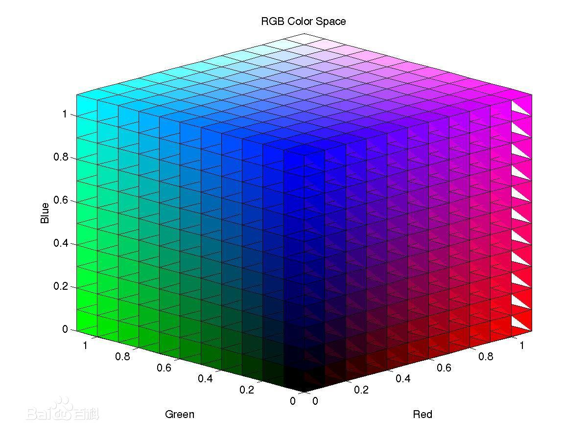

**常见颜色**

| 颜色名称       | 红色值 Red | 绿色值 Green | 蓝色值 Blue |
| -------------- | ---------- | ------------ | ----------- |
| 黑色           | 0          | 0            | 0           |
| 蓝色           | 0          | 0            | 255         |
| 绿色           | 0          | 255          | 0           |
| 青色           | 0          | 255          | 255         |
| 红色           | 255        | 0            | 0           |
| 洋红色(亮紫色) | 255        | 0            | 255         |
| 黄色           | 255        | 255          | 0           |
| 白色           | 255        | 255          | 255         |


* 灰度处理
``` python
img0 = cv.cvtColor(img, cv.COLOR_BGR2GRAY)
```


* 尺寸调整
``` python
img1 = cv.resize(img, (200, 300))
```


* 图片截取
``` python
img2 = img[200:300, 200:800]
```


* 置换图片
``` python
img3 = img.copy()
for i in range(400, 800):
    for j in range(400, 800):
        img3[i, j] = img0[i, j]
```
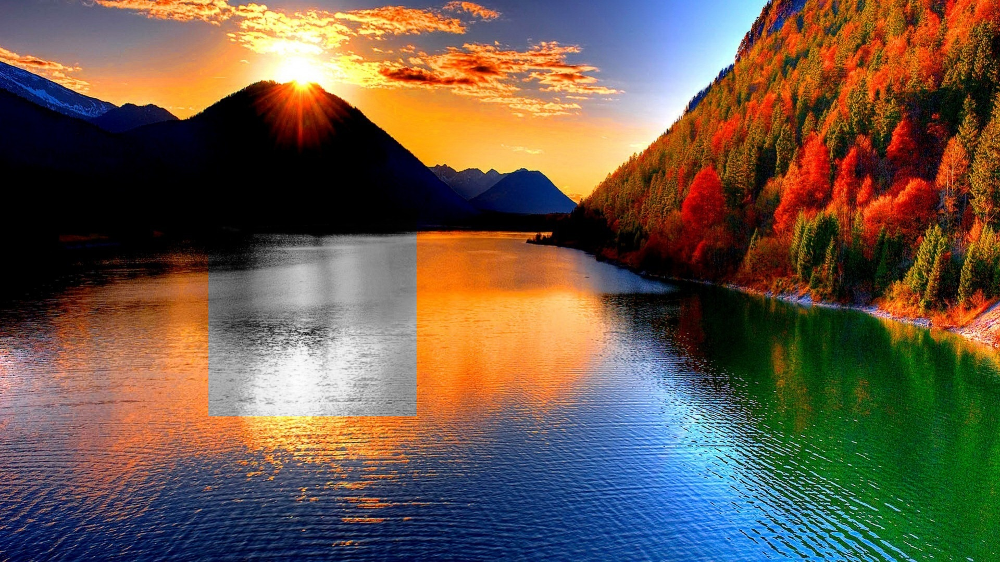

* 元素绘制
``` python
img4 = img.copy()
img4 = cv.line(img4, (1000,1000), (200,200), (255,0,255), 5)
img4 = cv.rectangle(img4, (1000,1000), (200,200), (0,255,0), 4)
img4 = cv.circle(img4, (600,150), 100, (0,0,255), 3)
pts = np.array([[1520,620],[1020,830],[1400,920],[650,910]])
img4 = cv.polylines(img4, [pts], True, (255,255,255), 2)
```
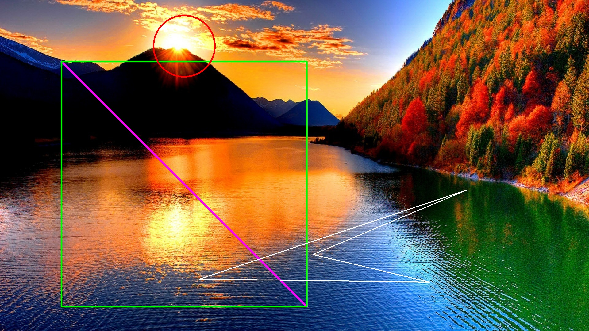

* 颜色取反
``` python
img5 = img.copy()
img5 = 255 - img5
```
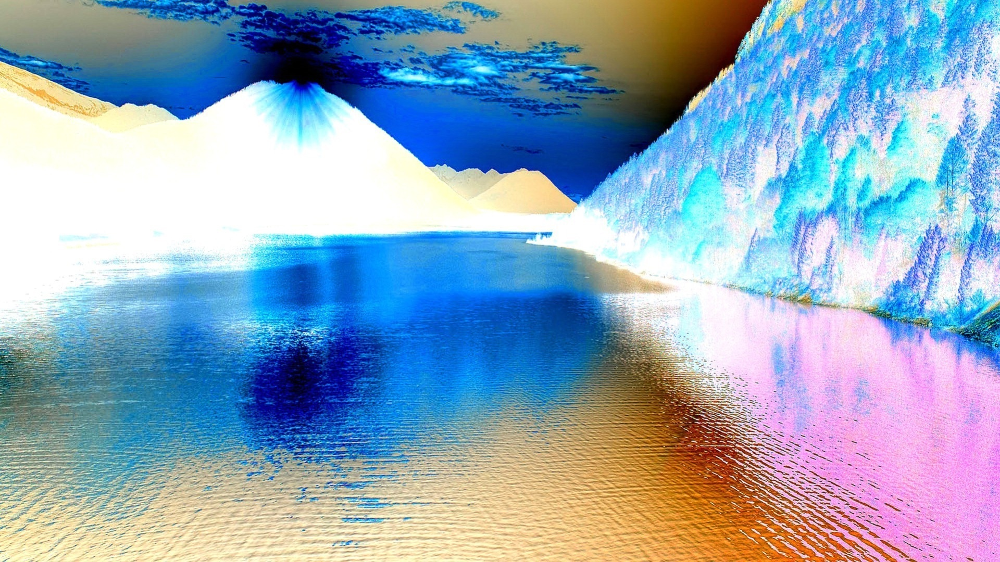

* 灰度二值处理
``` python
img6 = img0.copy()
ret, im_fixed = cv.threshold(img6, 50, 255, cv.THRESH_BINARY)
img6 = im_fixed.copy()
```
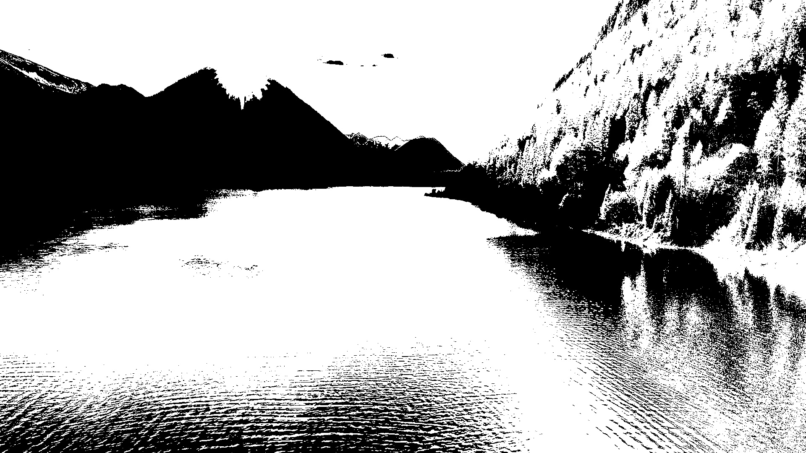

* 灰度gamma处理
``` python
import copy
img7 = copy.deepcopy(img0)
rows, cols = img7.shape

for i in range(rows):
    for j in range(cols):
        img7[i][j] = 3 * pow(img7[i][j], 0.8)
```


* 图片轮廓
``` python
imgA = img.copy()
imgray = cv.cvtColor(imgA, cv.COLOR_BGR2GRAY)
ret, thresh = cv.threshold(imgray, 127, 255, cv.THRESH_BINARY)
contours, hierarchy = cv.findContours(thresh, cv.RETR_EXTERNAL, cv.CHAIN_APPROX_NONE)
imgA[:] = 255
cv.drawContours(imgA, contours, -1, (0,0,255), 1)
```
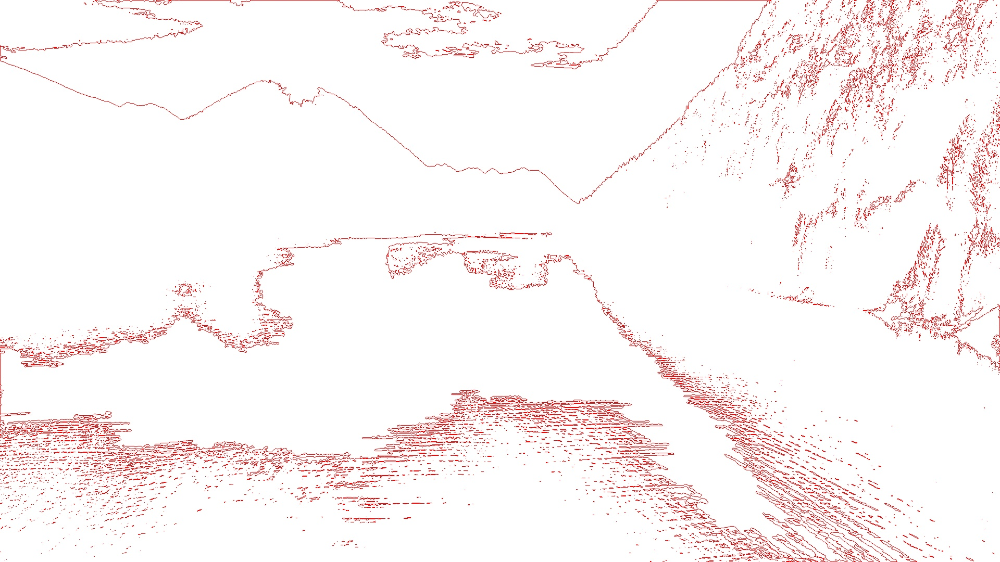

* 图片简单融合
``` python
img8_1 = img.copy()
img8_2 = cv.imread(f"yelp{ftype}")
img8_1 = cv.add(img8_1,img8_2)
```


``` python
img8_1 = img.copy()
img8_2 = cv.imread(f"yelp{ftype}")
img8_2 = img8_1 + img8_2
```
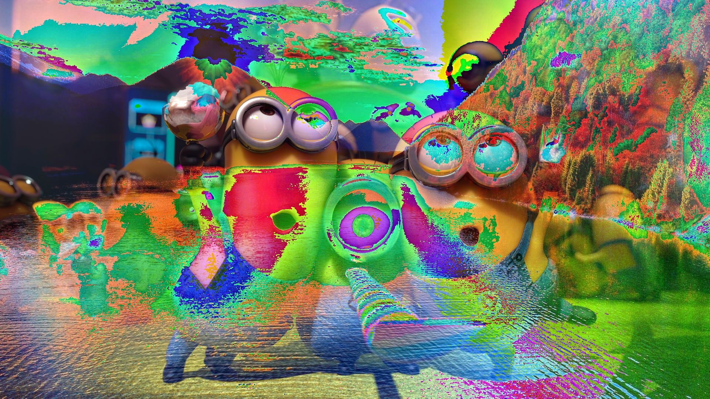

* 图片条件融合
``` python
img9_1 = img.copy()
img9_2 = cv.imread(f"yelp{ftype}")
img9_1 = img9_1 * 0.75 + img9_2 * 1.25
```
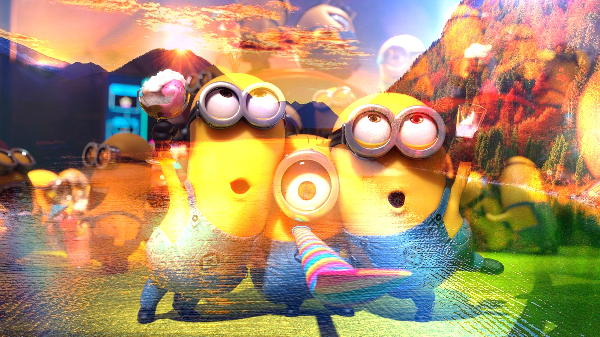

``` python
img9_1 = img.copy()
img9_2 = cv.imread(f"yelp{ftype}")
img9_2 = cv.addWeighted(img9_1, 0.75, img9_2, 1.25, 0)
```


* 图片颜色分割
``` python
imgC = img.copy()
imgCb, imgCg, imgCr = cv.split(imgC)
```
#### 颜色B
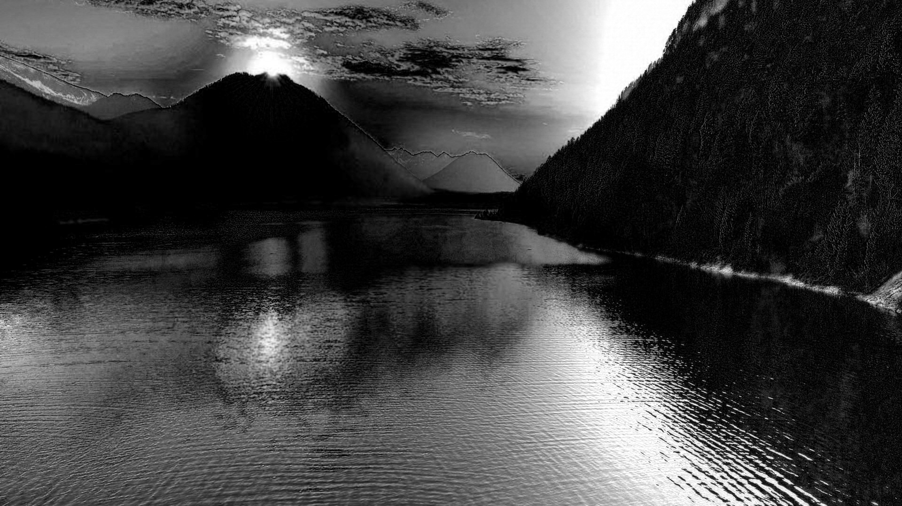
#### 颜色G

#### 颜色R


* 图片颜色融合
``` python
imgD_1 = img.copy()
imgD1b, imgD1g, imgD1r = cv.split(imgD_1)

imgD_2 = cv.imread(f"yelp{ftype}")
imgD2b, imgD2g, imgD2r = cv.split(imgD_2)

# 取图2颜色G部分融合至图1
imgD = cv.merge((imgD1b, imgD2g, imgD1r))
```
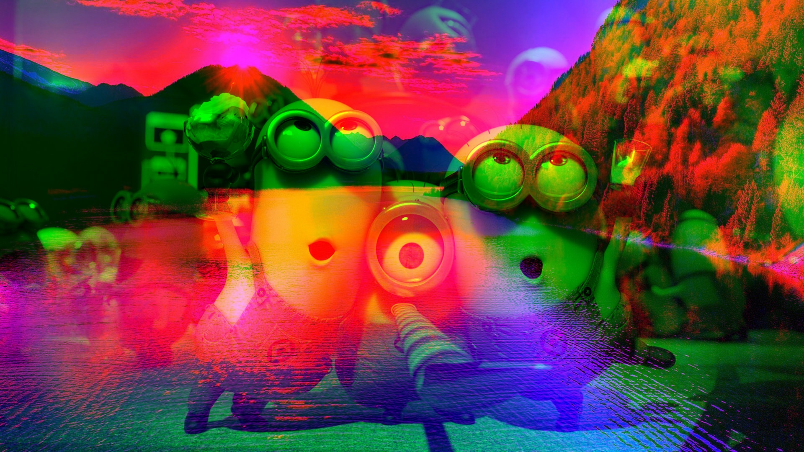

* 图片翻转
``` python
imgE = img.copy()
imgE = cv.flip(imgE, 1)
```


* 图片平移
``` python
imgF = img.copy()
rows, cols = imgF.shape[:2]

M = np.float32([[1, 0, 300], [0, 1, 100]])
imgF = cv.warpAffine(imgF, M, (cols, rows))
```


* 图片旋转
``` python
imgG = img.copy()
rows, cols = imgG.shape[:2]

M = cv.getRotationMatrix2D((cols/2, rows/2), 45, 0.5)
imgG = cv.warpAffine(imgG, M, (cols, rows))
```
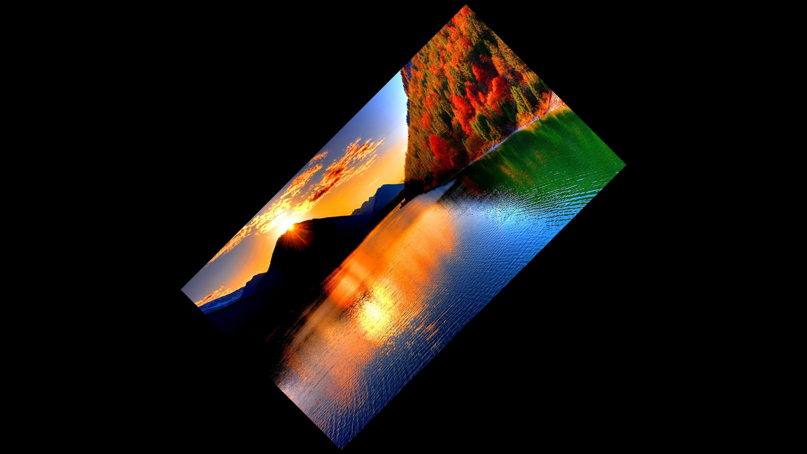

* 图片平滑
``` python
# 均值滤波
imgH1 = img.copy()
imgH1 = cv.blur(imgH1, (20, 20))
```


``` python
# 方框滤波
imgH2 = img.copy()
imgH2 = cv.boxFilter(imgH2, -1, (20, 20), normalize=True)
```


``` python
# 高斯滤波
imgH3 = img.copy()
imgH3 = cv.GaussianBlur(imgH3, (21, 21), 1)
```


``` python
# 中值滤波
imgH4 = img.copy()
imgH4 = cv.medianBlur(imgH4, 21)
```


``` python
# 双边滤波
imgH5 = img.copy()
imgH5 = cv.bilateralFilter(imgH5, 9, 75, 75) 
```


**Nice！**
